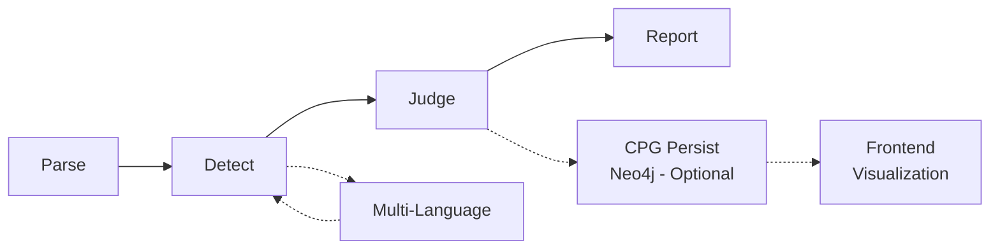

# CodeSec — Code Security Audit Platform

CodeSec is an automated SAST (Static Application Security Testing) platform that scans source code for security vulnerabilities, judges exploitability via call-graph analysis (BFS reachability, taint tracking, framework protection detection), and provides a human-in-the-loop audit workbench for triage, remediation, and tracking. CPG visualization is optional via Neo4j.

## Architecture

```
┌──────────────────────────────────────────────────────┐
│                    Frontend                           │
│      Vue 3 + TypeScript + Vite + Element Plus        │
│                                                        │
│  ┌──────────┐ ┌──────────┐ ┌──────────────────────┐  │
│  │ Dashboard│ │ Scans    │ │ Vulnerabilities       │  │
│  │ (ECharts)│ │ Manager  │ │ Browser + Search      │  │
│  └──────────┘ └──────────┘ └──────────────────────┘  │
│  ┌──────────┐ ┌──────────┐ ┌──────────────────────┐  │
│  │ Audit    │ │ Tickets  │ │ Reports / Rules /    │  │
│  │ Workbench│ │ Manager  │ │ Settings / Repos     │  │
│  └──────────┘ └──────────┘ └──────────────────────┘  │
│                                                        │
│  CodeMirror 6 (multi-lang)  ·  ECharts ·  Pinia       │
└──────────────────────┬───────────────────────────────┘
                       │ HTTP/REST (Axios)
┌──────────────────────▼───────────────────────────────┐
│                   Backend API                         │
│              Spring Boot 3 / Java 17                  │
│                                                        │
│  ┌──────────┐ ┌──────────┐ ┌──────────┐ ┌─────────┐  │
│  │ Security │ │ Repo Mgt│ │ Scan Mgt │ │ Vuln Mgt│  │
│  │ JWT/RBAC │ │ CRUD    │ │ Trigger  │ │ Findings│  │
│  └──────────┘ └──────────┘ └──────────┘ └─────────┘  │
│  ┌──────────┐ ┌──────────┐ ┌──────────┐ ┌─────────┐  │
│  │ Ticket   │ │ Audit    │ │ Webhook  │ │ Export  │  │
│  │ Manager  │ │ Log      │ │ Receiver │ │ (PDF)   │  │
│  └──────────┘ └──────────┘ └──────────┘ └─────────┘  │
│  ┌──────────┐ ┌──────────┐ ┌──────────────────────┐  │
│  │ Rule Mgt │ │ Dashboard│ │ Admin / Internal     │  │
│  │ (Allow-  │ │ (Stats)  │ │ Health / Mgmt        │  │
│  │ list)    │ │          │ │                      │  │
│  └──────────┘ └──────────┘ └──────────────────────┘  │
└──────┬────────────────┬────────────────┬─────────────┘
       │                │                │
       ▼                ▼                ▼
┌──────────────┐ ┌──────────────┐ ┌──────────────────┐
│   Worker     │ │ Engine-      │ │ ES-Integration   │
│   Queue      │ │ Adapter      │ │ Vuln/Snippet     │
│   Consumer   │ │ (Abstraction)│ │ Full-text Search │
└──────┬───────┘ └──────┬───────┘ └──────────────────┘
       │                │
       ▼                ▼
┌──────────────────────────────────────────────────────┐
│                    Scan Engine                        │
│  ┌─────────┐  ┌──────────┐  ┌────────────────────┐  │
│  │ AST     │  │Rule-based│  │ Call Graph         │  │
│  │ Parser  │→ │Detectors │  │ BFS Reachability   │  │
│  │JavaParser│ │          │  │                    │  │
│  └─────────┘  └──────────┘  └────────────────────┘  │
│                       │                              │
│                       ▼                              │
│  ┌──────────────────────────────────────────────┐    │
│  │ Multi-Language Extension                      │    │
│  │ Java + Go (tree-sitter) + Python (tree-sitter)│    │
│  └──────────────────────────────────────────────┘    │
│                       │                              │
│                       ▼                              │
│  ┌──────────────────────────────────────────────┐    │
│  │ Exploitability Judger                         │    │
│  │ · Taint tracking: input → vulnerable sink      │    │
│  │ · Framework protection detection               │    │
│  │ · Input controllability scoring                │    │
│  └──────────────────────────────────────────────┘    │
│                                                      │
│  Detectors: SQLi · XSS · Weak Crypto · Hardcoded     │
│  Credentials · Go Cmd Injection · Python Unsafe Eval │
└──────────────────────────────────────────────────────┘
       │
       ▼
┌──────────────────────────────────────────────────────┐
│              GitLab Integration                       │
│  Webhook Receiver → MR Diff Scan → Comment Reporter  │
└──────────────────────────────────────────────────────┘
       │
       ▼
┌──────────────────────────────────────────────────────┐
│              Neo4j (Optional)                         │
│  CPG visualization storage — bolt://localhost:7687    │
│  Populated manually via POST /api/v1/cpg/demo/{id}   │
└──────────────────────────────────────────────────────┘
```

### Module Map

| Module | Responsibility | Tech Stack |
|--------|---------------|------------|
| **`backend/api`** | REST API (port 8080) — 11 domain modules + CPG visualization endpoint | Spring Boot 3 / JPA / Flyway / PostgreSQL / Neo4j driver |
| **`backend/engine`** | SAST scan engine — AST parsing, rule-based detection, call-graph analysis, exploitability judgment, multi-language (Go, Python) | Java 17, JavaParser, tree-sitter, Neo4j driver |
| **`backend/engine-adapter`** | Abstraction layer decoupling `api` from `engine` — configurable engine routing | Spring |
| **`backend/es-integration`** | Elasticsearch integration — vuln finding indexing, code snippet indexing, full-text search | Spring Data ES |
| **`backend/gitlab-integration`** | GitLab webhook receiver, MR diff scanning, comment/note reporter | GitLab REST API |
| **`backend/worker`** | Async scan queue consumer (port 8081) — processes scan tasks, exploitability judgment, CPG built in-memory only | Spring Boot / ForkJoinPool |
| **`backend/common`** | Shared library — encryption (AES-GCM, KMS), base types, common utilities | Spring |
| **`frontend`** | SPA audit workbench — 11 views, 20+ components, 7 Pinia stores, full-text search UI | Vue 3.4 / TypeScript / Vite / Element Plus / Pinia / CodeMirror 6 / ECharts |

## Backend API Modules

```
backend/api/src/main/java/com/codesec/api/module/
├── admin/          — Admin operations
├── audit/          — Audit log queries & export
├── cpg/            — Call graph visualization (Neo4j-backed, optional)
├── dashboard/      — Aggregated statistics (vuln distribution, fix rate, severity breakdown)
├── export/         — PDF report generation (OpenPDF)
├── internal/       — Internal/health endpoints
├── repo/           — Repository CRUD
├── rule/           — Rule whitelist management (ProjectExemption)
├── scan/           — Scan trigger, status polling, history
├── ticket/         — Vulnerability ticket lifecycle
├── vuln/           — Vulnerability finding browser, filtering, search
└── webhook/        — GitLab webhook receiver
```

## Frontend Structure

```
frontend/src/
├── api/            — Axios HTTP client & typed API wrappers
├── components/     — Domain-organized components
│   ├── audit/      — Audit workbench (action panel, timeline, PoC, fix editor)
│   ├── code/       — CodeMirror 6 viewer with vulnerability line markers
│   ├── common/     — Shared UI (EmptyState, PageHeader, Skeleton, StatCard, TopProgressBar)
│   ├── layout/     — Shell layout (SidebarNav, TopBar, AppLayout)
│   ├── search/     — Full-text search (global search, filters, result items)
│   └── vuln/       — Vulnerability display (table, filters, badges, severity tags)
├── composables/    — Vue composables (useCrudStore, useGlobalShortcut)
├── router/         — Vue Router configuration
├── stores/         — 6 Pinia stores (audit, repo, scan, ticket, ui, vuln, search)
├── styles/         — CSS variables & global styles
├── types/          — TypeScript interfaces (vuln, ticket, audit, repo, scan, project)
├── utils/          — Shared utilities
└── views/          — 11 page views (Dashboard, Scans, Vuln, Ticket, Audit, Reports,
                     Rules, Repos, Settings, SearchResults, Login, Workbench)
```

## Quick Start

### Prerequisites

- Java 17+
- Maven 3.8+
- PostgreSQL 16
- Elasticsearch 8.x (optional, search features degrade gracefully)
- Neo4j 5.x (optional, CPG visualization only; exploitability judgment works in-memory without it)
- Node.js 18+ (for frontend)

### Backend

```bash
# Start infrastructure
docker compose up -d postgres elasticsearch neo4j

# Build all modules
mvn clean install -f backend/pom.xml

# Run API server (terminal 1)
mvn spring-boot:run -f backend/api/pom.xml

# Run worker (terminal 2)
mvn spring-boot:run -f backend/worker/pom.xml
```

### Frontend

```bash
cd frontend
npm install
npm run dev
```

### Full Stack (Docker)

```bash
docker compose up --build
```

## Environment Variables

| Variable | Default | Description |
|----------|---------|-------------|
| `SPRING_DATASOURCE_URL` | `jdbc:postgresql://localhost:5432/codesec` | PostgreSQL JDBC URL |
| `SPRING_DATASOURCE_USERNAME` | `codesec` | Database user |
| `SPRING_DATASOURCE_PASSWORD` | `codesec123` | Database password |
| `JWT_SECRET` | *(auto-generated)* | JWT signing key |
| `ES_HOST` | `localhost:9200` | Elasticsearch host |
| `NEO4J_URI` | `bolt://localhost:7687` | Neo4j bolt URI (CPG visualization) |
| `NEO4J_USERNAME` | `neo4j` | Neo4j user |
| `NEO4J_PASSWORD` | `admin123` | Neo4j password |
| `CODEX_CODE_MODEL` | `gpt-4o` | LLM model for code analysis |
| `CODEX_LLM_MODEL` | `gpt-4o` | LLM model for reasoning |

## Scan Pipeline

The engine executes a multi-phase pipeline for each scan:



### 1. Parse
AST construction using **JavaParser** (Java) and **tree-sitter** (Go, Python). Builds a project-level method symbol table and call graph skeleton.

### 2. Detect
Rule-based detectors match vulnerability patterns across supported languages:

| Detector | Language | Pattern |
|----------|----------|---------|
| SQL Injection | Java | MyBatis `${}` / JPA `@Query` concatenation / Hibernate HQL injection |
| Cross-Site Scripting | Java | Unsafe reflection output, `Response.sendRedirect()` with user input |
| Weak Cryptography | Java | DES, MD5, SHA-1, ECB mode, static IV |
| Hardcoded Credentials | Java | Password/secret/API key literals |
| Command Injection | Go | `exec.Command` with unsanitized input |
| Unsafe Eval | Python | `eval()`, `exec()`, `pickle.loads()` with tainted input |

### 3. Judge — Exploitability Analysis
- **BFS call-graph reachability** — traces from framework entry points (controllers, listeners) to vulnerable sinks
- **Taint tracking** — user-controllable input propagation through method parameters
- **Framework protection detection** — Spring Security annotations, ESAPI wrappers
- **Input controllability scoring** — `exploitable` / `potentially_exploitable` / `not_exploitable`

The call graph is built **in-memory** by `CallGraphBuilder` and shared across all three analyzers. Neo4j persistence (`buildAndPersist`) is available but not wired into the scan pipeline — CPG visualization data is populated manually via `POST /api/v1/cpg/demo/{vulnId}`.

### 4. Report
Structured findings with: CWE/CVE identifiers, severity (Critical/High/Medium/Low), exploitability level, code snippet with line range, fix suggestion, and engine raw trace.

## Development

```bash
# Run all backend tests
mvn test -f backend/pom.xml

# Run specific module tests
mvn test -f backend/engine/pom.xml

# Lint frontend
cd frontend && npm run lint

# Type-check frontend
cd frontend && npm run type-check

# Run frontend unit tests
cd frontend && npm run test:unit
```

## Scripts

| Script | Purpose |
|--------|---------|
| `scripts/e2e-smoke.sh` | End-to-end smoke test |
| `scripts/run-demo.sh` | Launch demo environment |
| `scripts/migrate-kms.sh` | KMS key migration utility |

## License

MIT
