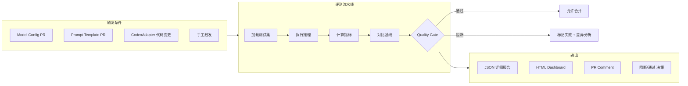
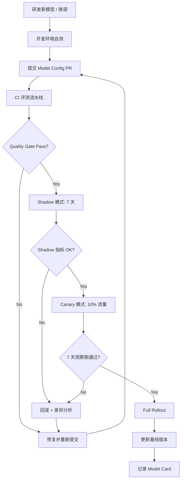

# AI 质量评测体系设计方案

> **版本**: v1.0  
> **状态**: Draft  
> **关联**: PRD § 1.3 业务目标（误报率降低 80%+、逻辑漏洞检出率提升 40%）,  
>          codex-integration-design.md (CodeX 四大能力), cpg-storage-design.md (CPG 上下文)  
> **前置依赖**: codex-integration-design.md (AI 接口定义)

---

## 1. 设计目标

建立覆盖大模型 API（代码模型 + 语义模型）的 AI 质量评测体系，确保：
1. AI 能力的每次升级可量化、可对比、可回归
2. 生产环境 AI 输出质量持续可观测
3. 误报过滤、漏洞分析、POC/补丁生成均有明确的质量门禁
4. API 模型版本切换和 Prompt 变更引起的质量变化可追踪、可回滚

---

## 2. 评测维度与指标矩阵

### 2.1 指标总览

| 能力维度 | 核心指标 | 目标值（V1.0） | 目标值（V1.1） | 测量方法 |
|----------|---------|---------------|---------------|----------|
| 漏洞分析 | Precision | ≥ 85% | ≥ 90% | 人工标注基准测试集 |
| 漏洞分析 | Recall | ≥ 80% | ≥ 85% | 人工标注基准测试集 |
| 漏洞分析 | F1-score | ≥ 82% | ≥ 87% | 综合计算 |
| 误报过滤 | Filter Accuracy | ≥ 90% | ≥ 95% | 人工复判 |
| 误报过滤 | Missed-filter Rate | ≤ 3% | ≤ 1% | 真实漏洞被误标为 FP |
| 可利用性判定 | Exploitability Accuracy | ≥ 80% | ≥ 88% | 三分类准确率 |
| CWE 分类 | CWE Accuracy | ≥ 75% | ≥ 85% | Top-1 匹配率 |
| POC 生成 | Compilation Rate | - | ≥ 70% | 编译校验 |
| POC 生成 | Exploit Correctness | - | ≥ 80% | 沙箱验证 |
| 补丁生成 | Compilation Pass Rate | - | ≥ 85% | 编译校验 |
| 补丁生成 | Fix Correctness | - | ≥ 80% | 人工 + 自动化测试 |
| 端到端 | Human Acceptance Rate | ≥ 70% | ≥ 85% | 审计员采纳率 |

### 2.2 详细指标定义

#### 2.2.1 漏洞分析指标

```python
# 在 benchmark 测试集上的计算方法

# Precision = TP / (TP + FP)
# 模型标记为"真实漏洞"的样本中，实际为真实漏洞的比例
precision = true_positives / (true_positives + false_positives)

# Recall = TP / (TP + FN)
# 实际存在的漏洞中，模型正确识别出的比例
recall = true_positives / (true_positives + false_negatives)

# F1 = 2 * P * R / (P + R)
f1 = 2 * precision * recall / (precision + recall)

# 按漏洞类型拆分计算（SQLi / XSS / CMDi / ...）
per_type_metrics = {
    vuln_type: {
        "precision": ..., "recall": ..., "f1": ...
    }
    for vuln_type in benchmark_vuln_types
}

# 按严重度拆分计算（Critical / High / Medium / Low）
per_severity_metrics = {
    severity: {
        "precision": ..., "recall": ...
    }
    for severity in ["critical", "high", "medium", "low"]
}
```

#### 2.2.2 误报过滤指标

```python
# Filter Accuracy = 正确分类的 FP / 总 FP 候选
filter_accuracy = correctly_filtered / total_fp_candidates

# Missed-filter Rate = 被误标为 FP 的真实漏洞 / 总真实漏洞
missed_filter_rate = false_vulns_marked_fp / total_true_vulns
# 注：这是最危险的指标，真实漏洞不可被误标为 FP
# 门禁要求：missed_filter_rate ≤ 3%

# 误报还原率 = SAST 告警总数中 AI 确认的非误报比例
fp_reduction_rate = 1 - (confirmed_vulns / raw_alerts)
# PRD 要求：≥ 80%（原始告警降低 80%）
```

#### 2.2.3 可利用性判定指标

```python
# 三分类混淆矩阵
# 类别: exploitable / potentially_exploitable / not_exploitable

# Macro-F1: 三类 F1 的算术平均
macro_f1 = average(f1_exploitable, f1_potential, f1_not_exploitable)

# Weighted-F1: 按各类样本数加权平均
weighted_f1 = weighted_average(f1_exploitable, weight_exploitable, ...)

# 特别关注 exploitable 的 Recall（宁枉勿纵）
exploitability_recall_exploitable = tp_exploitable / (tp_exploitable + fn_exploitable)
# 目标：≥ 90%（宁可多报不可漏报可利用漏洞）
```

#### 2.2.4 置信度校准指标

```python
# Expected Calibration Error (ECE)
# 将置信度 [0,1] 分为 K 个等宽桶
# 每个桶内：accuracy vs avg_confidence 的差值的加权平均

def ece(predictions, labels, n_bins=10):
    bin_boundaries = np.linspace(0, 1, n_bins + 1)
    bin_lowers = bin_boundaries[:-1]
    bin_uppers = bin_boundaries[1:]
    
    total_accuracy = 0
    for i in range(n_bins):
        in_bin = (predictions >= bin_lowers[i]) & (predictions < bin_uppers[i])
        prop_in_bin = np.mean(in_bin)
        if prop_in_bin > 0:
            avg_confidence_in_bin = np.mean(predictions[in_bin])
            accuracy_in_bin = np.mean(labels[in_bin])
            total_accuracy += np.abs(avg_confidence_in_bin - accuracy_in_bin) * prop_in_bin
    return total_accuracy

# 目标 ECE < 0.05（模型说 80% 置信时，实际正确率约 80%）
```

### 2.3 指标权重与综合评分

```yaml
# 综合质量评分（用于模型间横向对比，满分 100）
composite_score_v1_0:
  weights:
    precision: 0.25
    recall: 0.25
    filter_accuracy: 0.20
    exploitability_accuracy: 0.10
    cwe_accuracy: 0.10
    ece: 0.10              # ECE 越低越好

  scoring:
    precision_score: "min(precision / 0.85, 1.0) × 100"
    recall_score: "min(recall / 0.80, 1.0) × 100"
    filter_accuracy_score: "min(filter_accuracy / 0.90, 1.0) × 100"
    exploitability_score: "min(exploitability_accuracy / 0.80, 1.0) × 100"
    cwe_score: "min(cwe_accuracy / 0.75, 1.0) × 100"
    ece_score: "max(1 - ece / 0.05, 0) × 100"
    
    composite: "weighted_sum / total_weight"
```

---

## 3. 基准测试集设计

### 3.1 测试集结构

```
evaluation/
├── datasets/
│   ├── v1.0/
│   │   ├── synthetic/               # 合成数据集
│   │   │   ├── java/
│   │   │   │   ├── sqli/            # SQL 注入样本
│   │   │   │   │   ├── 001.sql       # 漏洞特征描述
│   │   │   │   │   ├── 001.java      # 含漏洞的源码
│   │   │   │   │   ├── 001.clean.java # 修复后的安全代码
│   │   │   │   │   ├── 001.meta.json # 元数据
│   │   │   │   │   └── ...
│   │   │   │   ├── xss/
│   │   │   │   ├── command_injection/
│   │   │   │   └── ...
│   │   │   ├── go/
│   │   │   │   ├── command_injection/
│   │   │   │   └── ...
│   │   │   └── python/
│   │   │       ├── unsafe_eval/
│   │   │       └── ...
│   │   ├── real_world/              # 真实脱敏样本
│   │   │   ├── java/
│   │   │   ├── go/
│   │   │   └── python/
│   │   └── edge_cases/              # 边界样本
│   │       ├── framework_protected/ # 框架保护场景
│   │       ├── fp_traps/            # 误报陷阱
│   │       └── multi_step/          # 多步调用链
│   └── v1.1/                        # 版本化迭代
├── ground_truth/
│   └── v1.0/
│       ├── vuln_analysis.json       # 漏洞分析标注
│       ├── fp_filter.json           # 误报过滤标注
│       └── exploitability.json      # 可利用性标注
├── results/                         # 评测结果（CI 自动生成）
│   └── {model_version}/
│       ├── report.json
│       └── report.html
└── scripts/
    ├── eval.py                      # 评测入口
    ├── metrics.py                   # 指标计算
    ├── report.py                    # 报告生成
    ├── dataset.py                   # 数据集管理
    └── compare.py                   # 基线对比
```

### 3.2 合成数据集规格

| 语言 | 漏洞类型 | 样本数 | 覆盖场景 |
|------|----------|--------|----------|
| Java | SQL 注入 | 50+ | MyBatis `${}`, JPA `@Query` concat, JDBC 拼接 |
| Java | XSS | 40+ | 反射输出, `sendRedirect`, `printWriter` |
| Java | 命令注入 | 30+ | `Runtime.exec`, `ProcessBuilder` |
| Java | 路径遍历 | 30+ | `File`, `Paths.get` 未校验 |
| Java | SSRF | 20+ | `URL`, `HttpURLConnection` |
| Java | XXE | 15+ | `DocumentBuilder` 未禁用 DTD |
| Java | 弱加密 | 25+ | DES, MD5, ECB, 静态 IV |
| Java | 硬编码凭据 | 15+ | password/key/secret 字面量 |
| Go | 命令注入 | 30+ | `exec.Command` 未校验 |
| Go | SQL 注入 | 20+ | `database/sql` 拼接 |
| Python | unsafe eval | 20+ | `eval()`, `exec()`, `pickle.loads()` |
| Python | 命令注入 | 20+ | `os.system`, `subprocess` |
| Python | 路径遍历 | 15+ | `open()` 未校验 |
| **合计** | | **330+** | |

### 3.3 样本元数据格式

```json
{
  "id": "java-sqli-001",
  "language": "java",
  "vuln_type": "sql_injection",
  "cwe": "CWE-89",
  "severity": "high",
  "file_path": "synthetic/java/sqli/001.java",
  "clean_path": "synthetic/java/sqli/001.clean.java",
  "line_start": 15,
  "line_end": 18,
  "code_snippet": "String sql = \"SELECT * FROM users WHERE id = \" + userId;",
  "has_framework_protection": false,
  "exploitable": true,
  "exploit_condition": "userId 来自 HTTP 参数且无任何校验",
  "entry_point": "UserController.getUser(@PathVariable String userId)",
  "taint_propagation": ["userId", "id"],
  "sink": "stmt.executeQuery(sql)",
  "framework": "Spring Boot 3.x (no security config)"
}
```

### 3.4 边界样本集

| 类别 | 描述 | 样本数 | 难度 |
|------|------|--------|------|
| 框架保护 | Spring `@PreAuthorize` 保护的 Controller | 20 | 高 |
| 参数化查询 | MyBatis `#{}` vs `${}` 边界 | 15 | 高 |
| 输入净化 | XSS 经过 `HtmlUtils.htmlEscape()` | 15 | 高 |
| 误报陷阱 | 看似漏洞但框架自动防御 | 15 | 中 |
| 多步调用 | 污染源经过 5+ 层函数调用到达汇聚点 | 10 | 高 |
| 跨服务 | A 服务 → HTTP → B 服务的调用链 | 10 | 极高 |

### 3.5 数据集版本管理

```yaml
dataset_versioning:
  storage: "git-lfs (小规模) | MinIO bucket (生产)"
  naming: "v{major}.{minor}"
  
  version_update:
    major_bump: "新增语言支持 / 新增漏洞类型"
    minor_bump: "补充样本 / 修正标注错误"
  
  changelog:
    format: "每个版本记录新增/修改/删除的样本列表"
    review: "版本更新需安全工程师审核标注"

  splitting:
    train: "60%"       # 仅用于参考（模型训练时使用）
    validation: "20%"  # 参数调优验证
    evaluation: "20%"  # 最终评测（严格与训练集隔离）
```

---

## 4. 评测流水线

### 4.1 CI 集成架构



### 4.2 GitLab CI 模板

```yaml
# .gitlab-ci.yml 片段
evaluate-ai:
  stage: test
  image: python:3.11-slim
  variables:
    EVAL_DATASET: "v1.0"
    EVAL_CODEPROMPT: "prompts/vuln-analysis-v2.yaml"  # 关联 prompt 版本
    EVAL_LLM_API_ENDPOINT: ${CODEX_API_ENDPOINT}
    EVAL_LLM_API_KEY: ${CODEX_API_KEY}
    EVAL_MODEL: "gpt-4o-2024-08-06"                    # 锚定具体 API 模型版本
    EVAL_BASELINE: "v1.0-baseline"
  script:
    - pip install -r evaluation/requirements.txt
    - python evaluation/scripts/eval.py
        --dataset evaluation/datasets/$EVAL_DATASET
        --output evaluation/results/$CI_COMMIT_REF_NAME
        --baseline evaluation/results/$EVAL_BASELINE/report.json
        --api-base $EVAL_LLM_API_ENDPOINT
        --api-key $EVAL_LLM_API_KEY
        --model $EVAL_MODEL
    - python evaluation/scripts/report.py
        --input evaluation/results/$CI_COMMIT_REF_NAME/report.json
        --output evaluation/results/$CI_COMMIT_REF_NAME/report.html
    - python evaluation/scripts/compare.py
        --current evaluation/results/$CI_COMMIT_REF_NAME/report.json
        --baseline evaluation/results/$EVAL_BASELINE/report.json
        --gate evaluation/gates/v1.0.yaml
  artifacts:
    paths:
      - evaluation/results/$CI_COMMIT_REF_NAME/
    reports:
      metrics: evaluation/results/$CI_COMMIT_REF_NAME/metrics.txt
  only:
    changes:
      - backend/codex-integration/**/*
      - evaluation/**/*
      - prompts/**/*
```

### 4.3 质量门禁配置

```yaml
# evaluation/gates/v1.0.yaml
gate_version: "v1.0"
description: "AI 质量门禁 V1.0"

blocking_rules:
  # 低于阈值则阻断合并
  - metric: "precision"
    min: 0.80                  # 不允许 Precision < 80%
    regression: -0.03          # 不允许比基线下降超过 3%

  - metric: "recall"
    min: 0.75
    regression: -0.03

  - metric: "filter_accuracy"
    min: 0.85
    regression: -0.05

  - metric: "missed_filter_rate"
    max: 0.05                  # 不可超过 5%
    regression: +0.02          # 不可比基线增加超过 2%

  - metric: "ece"
    max: 0.08
    regression: +0.03

warning_rules:
  # 低于阈值则警告（不阻断）
  - metric: "exploitability_exploitable_recall"
    min: 0.85

  - metric: "cwe_accuracy"
    min: 0.70

  - metric: "f1_score"
    min: 0.78
```

### 4.4 报告格式

```json
// evaluation/results/{version}/report.json
{
  "eval_info": {
    "timestamp": "2026-07-02T10:00:00Z",
    "api_model": "gpt-4o-2024-08-06",         # API 模型版本锚定
    "api_provider": "openai",                  # API 提供商
    "prompt_version": "vuln-analysis-v2",      # Prompt 版本快照
    "dataset_version": "v1.0",
    "ci_job_id": "12345",
    "git_sha": "abc123def456"
  },
  "summary": {
    "composite_score": 87.5,
    "verdict": "PASS",
    "regression_found": false,
    "total_samples": 330,
    "passed_gates": 7,
    "total_gates": 8,
    "warnings": 1
  },
  "metrics": {
    "precision": { "value": 0.87, "baseline": 0.85, "regression": false },
    "recall": { "value": 0.83, "baseline": 0.81, "regression": false },
    "f1_score": { "value": 0.85, "baseline": 0.83, "regression": false },
    "filter_accuracy": { "value": 0.92, "baseline": 0.90, "regression": false },
    "missed_filter_rate": { "value": 0.02, "baseline": 0.03, "regression": true, "action": "investigate" },
    "ece": { "value": 0.04, "baseline": 0.05, "regression": false }
  },
  "per_type_metrics": {
    "sql_injection": { "precision": 0.92, "recall": 0.90, "f1": 0.91 },
    "xss": { "precision": 0.85, "recall": 0.82, "f1": 0.83 },
    "command_injection": { "precision": 0.88, "recall": 0.85, "f1": 0.86 }
  },
  "failures": [
    {
      "sample_id": "java-xss-015",
      "expected": "xss",
      "predicted": "none",
      "confidence": 0.35,
      "analysis": "AI 误判为安全：XSS 通过 innerHTML 赋值但 AI 认为 Angular 模板会做转义"
    }
  ],
  "warnings": [
    {
      "rule": "ece > 0.05",
      "current": 0.04,
      "threshold": 0.08,
      "message": "置信度校准良好"
    }
  ]
}
```

---

## 5. 模型比较与升级治理

### 5.1 模型/Prompt 升级流程

> **注**：API 模式下"模型升级"指更改 API 模型版本（如 `gpt-4o-2024-08-06` → `gpt-4o-2025-01-01`）或 prompt 模板变更。



### 5.2 模型卡片模板

```markdown
## Model Card: API-{provider}-{model}-v{date}

### 基本信息

| 字段 | 值 |
|------|-----|
| API 提供商 | OpenAI |
| 模型名称 | gpt-4o |
| 模型版本 | 2024-08-06 |
| 使用的 Prompt 版本 | vuln-analysis-v2 |
| 评测日期 | 2026-07-02 |
| 备注 | 通过 API 调用评测，每次评测记录 Prompt 快照 |

### 评估结果

| 指标 | 当前 | 基线 | 变化 |
|------|------|------|------|
| Precision | 87% | 85% | +2% ✅ |
| Recall | 83% | 81% | +2% ✅ |
| F1 | 85% | 83% | +2% ✅ |
| Filter Accuracy | 92% | 90% | +2% ✅ |
| Missed-filter Rate | 2% | 3% | -1% ✅ |
| ECE | 0.04 | 0.05 | -0.01 ✅ |

### 已知限制

| 限制 | 说明 | 严重度 | 缓解措施 |
|------|------|--------|----------|
| PHP 语言覆盖不足 | PHP 样本仅 15 个，精度 72% | Medium | V1.1 补充数据集 |
| 多步调用链（5+ 层） | 调用链超过 5 层的路径分析精度下降 | Medium | 依赖 CPG 缩短链路 |
| SSRF 误报 | 将 HTTP 客户端调用误判为 SSRF | Low | 增加框架白名单 |
| 长代码片段（200+ 行） | 长度超过 200 行的片段分析置信度下降 | Low | 代码截断 + 分段分析 |

### 安全与偏见评估

| 检查项 | 结果 | 备注 |
|--------|------|------|
| 对抗性输入鲁棒性 | 通过 | 随机代码扰动测试 |
| 语言偏见 | 无显著偏见 | Java/Go/Python 表现一致 |
| 框架偏见 | Spring 框架样本精度略高 | 训练集中 Spring 样本较多 |
```

### 5.3 A/B 测试框架

```yaml
# 生产环境 A/B 测试配置
ab_test:
  shadow_mode:
    description: "新模型与生产模型并行运行，结果仅记录不展示"
    traffic_split: "100% 流量双发（主模型响应 + 影子模型异步）"
    duration: "7 天"
    evaluation:
      - "逐样本对比主模型与影子模型的结论"
      - "不一致样本自动记录到 eval_ discrepancies 表"
      - "不一致率 < 5% 才允许进入 Canary"
  
  canary_mode:
    description: "10% 生产流量走新模型"
    traffic_split:
      canary: "10%"
      primary: "90%"
    duration: "7 天"
    evaluation:
      - "用户反馈采集（人工审计员对 AI 结论的采纳/拒绝率）"
      - "延迟对比（Canary P99 vs Primary P99）"
      - "降级触发率对比"
    rollback_conditions:
      - "Human Acceptance Rate 下降 > 5%"
      - "P99 延迟增加 > 20%"
      - "降级触发率增加 > 3%"

  full_rollout:
    conditions:
      - "Canary 观察期无回滚触发"
      - "质量门禁通过"
      - "安全负责人 + AI 工程师双签"
```

---

## 6. 生产质量监控

### 6.1 实时监控面板（Grafana）

```yaml
  grafana_dashboards:
    ai_service_overview:
      panels:
        - title: "API 请求量"
          metric: "codex_requests_total"
          rate: "5m rate"
        
        - title: "P50 / P95 / P99 延迟"
          metric: "codex_request_duration_seconds"
          type: "histogram_quantile(0.99)"
          alert: "P99 > 30s → Warning"
        
        - title: "API 错误率"
          metric: "codex_errors_total / codex_requests_total"
          alert: "> 5% → Warning, > 10% → Critical"
          breakdown: "by status (timeout/429/401/5xx)"
        
        - title: "降级触发率"
          metric: "codex_fallback_total / codex_requests_total"
          alert: "> 5% → Warning"
          drilldown: "按降级等级（LLM_API_ONLY / SAST_ONLY）拆分"
        
        - title: "API 速率限制(RPM) 使用率"
          metric: "codex_rpm_usage_ratio"
          alert: "> 80% → Warning"
        
        - title: "API 调用费用（日累计）"
          metric: "codex_api_cost_daily"
          alert: "> 日预算 150% → Warning"

  ai_quality_dashboard:
    panels:
      - title: "Human Acceptance Rate（7d 滑动窗口）"
        metric: "ai_acceptance_rate"
        calculation: "count(ai_verdict == human_verdict) / count(total_audited)"
        alert: "< 70% → Warning"
      
      - title: "AI vs Human 不一致趋势"
        metric: "ai_discrepancy_rate"
        breakdown: "by vuln_type, by severity"
      
      - title: "每日 Feedback 收集量"
        metric: "ai_feedback_collected_total"
      
      - title: "数据漂移得分（输入分布 KL 散度）"
        metric: "input_drift_score"
        alert: "> 0.1 → 触发重新评估"
      
      - title: "概念漂移得分（Human Acceptance 趋势）"
        metric: "concept_drift_score"
        alert: "显著下降 → 触发重新评估"
```

### 6.2 反馈闭环

```yaml
feedback_loop:
  # 数据收集
  collection:
    - source: "人工审计操作（确认/误报/存疑）"
      storage: "findings.ai_verdict + auditor_decision"
    - source: "工单生命周期状态变更"
      storage: "tickets.history"
    - source: "审计员主动反馈评分（好/差）"
      storage: "ai_feedback table"

  # 定期分析
  analysis:
    weekly:
      - "不一致样本差异分析（AI 说 A, 人说是 B）"
      - "按漏洞类型 + 严重度拆分不一致率"
      - "输出: 不一致报告 + 改进建议"
    
    monthly:
      - "AI 精度趋势报告（对标基线）"
      - "生产数据补充基准测试集候选"
      - "输出: 月度质量简报"

    quarterly:
      - "基准测试集刷新（补充新发现类型）"
      - "模型重新评估 + 模型卡片更新"
      - "输出: 季度质量报告"

  # 数据利用
  data_usage:
    - "不一致样本 → 人工审核 → 确认为 Ground Truth"
    - "Ground Truth → 补充基准测试集"
    - "基准测试集 → 模型微调 / Prompt 优化"
```

### 6.3 漂移检测

```python
# evaluation/scripts/drift_detection.py

def detect_data_drift(current_distribution, baseline_distribution, threshold=0.1):
    """
    KL 散度检测输入代码特征的分布漂移。
    
    监控特征:
    - 语言分布（Java/Go/Python 占比）
    - 代码长度分布
    - 漏洞类型分布（SQLi/XSS/CMDi 占比）
    - 文件路径深度分布
    """
    kl_divergence = compute_kl(current_distribution, baseline_distribution)
    return {
        "drift_detected": kl_divergence > threshold,
        "kl_score": kl_divergence,
        "threshold": threshold,
        "recommendation": "re-evaluate" if kl_divergence > threshold else "no_action"
    }


def detect_concept_drift(acceptance_rate_timeseries, window_days=7, decline_threshold=0.05):
    """
    滑动窗口检测 Human Acceptance Rate 概念漂移。
    
    如果连续窗口内 Human Acceptance Rate 持续下降超过阈值，
    说明模型输出与人类预期出现偏差，需要触发重新评估。
    """
    current_window = compute_sliding_window(acceptance_rate_timeseries, days=window_days)
    previous_window = compute_sliding_window(acceptance_rate_timeseries, 
                                              days=window_days, offset=window_days)
    
    decline = previous_window - current_window
    return {
        "concept_drift": decline > decline_threshold,
        "current_acceptance": current_window,
        "previous_acceptance": previous_window,
        "decline": decline,
        "recommendation": "trigger_re_evaluation" if decline > decline_threshold else "normal"
    }
```

---

## 7. 评测工具实现

### 7.1 Python 工具包

```python
# evaluation/scripts/eval.py — 入口

def main():
    parser = argparse.ArgumentParser()
    parser.add_argument("--dataset", required=True)
    parser.add_argument("--output", required=True)
    parser.add_argument("--baseline")
    parser.add_argument("--api-base", default="http://codex-service:8080")
    parser.add_argument("--gate", default="evaluation/gates/v1.0.yaml")
    args = parser.parse_args()
    
    # 1. 加载测试集
    dataset = DatasetLoader.load(args.dataset)
    
    # 2. 逐样本执行推理
    runner = InferenceRunner(api_base=args.api_base, model="codex")
    results = runner.run(dataset.samples)
    
    # 3. 计算指标
    metrics = MetricsCalculator.compute(results, dataset.ground_truth)
    
    # 4. 对比基线
    comparison = BaselineComparer.compare(metrics, args.baseline)
    
    # 5. 质量门禁判断
    gate = QualityGate(args.gate)
    verdict = gate.evaluate(metrics, comparison)
    
    # 6. 生成报告
    report = ReportGenerator.generate(metrics, comparison, verdict)
    report.save(args.output)
    
    # 7. 输出门禁结果（CI 可读）
    print(f"VERDICT={verdict.status}")
    print(f"COMPOSITE_SCORE={metrics.composite_score:.1f}")
    
    sys.exit(0 if verdict.passed else 1)
```

### 7.2 依赖清单

```txt
# evaluation/requirements.txt
pyyaml>=6.0
numpy>=1.24
pandas>=2.0
httpx>=0.25
pydantic>=2.0
jinja2>=3.1
scikit-learn>=1.3
```

### 7.3 工具集成路径

```yaml
tool_integration:
  location: "evaluation/ 目录"
  language: "Python 3.11+"
  
  ci_integration:
    gitlab: ".gitlab-ci.yml 中引用 evaluate-ai job"
    github: "evaluation/.github/workflows/eval.yml"
  
  dataset_storage:
    small: "git-lfs（< 500MB）"
    large: "MinIO bucket（> 500MB）"
    access: "CI 环境变量 $DATASET_ENDPOINT / $DATASET_BUCKET"

  model_card_storage:
    path: "evaluation/model-cards/{model_name}-v{version}.md"
    template: "evaluation/templates/model-card-template.md"
  
  baseline:
    storage: "evaluation/results/baseline/"
    update: "每次 full rollout 后更新"
    versioning: "baseline-v{major}.{minor}"
```

---

## 8. 与现有组件的集成

| 现有组件 | 集成方式 | 变更说明 |
|----------|----------|----------|
| `backend/codex-integration/` | 评测工具通过 HTTP 调用 CodexAdapter API | 需要暴露 `/api/v1/ai/evaluate` 端点 |
| `CodexResponse` 模型 | 评测工具解析统一响应格式 | 无需变更 |
| `PromptRepository` | 评测使用独立的测试 Prompt | 无需变更 |
| `FallbackStrategy` | 评测需验证降级策略正确性 | 增加集成测试 |
| CI/CD 流水线 | `.gitlab-ci.yml` 增加 evaluate-ai job | 新增 CI 阶段 |
| `docs/architecture.md` | 补充 AI 评测体系章节 | 需更新架构文档 |
| `docs/c4-architecture.md` | 补充评测工具容器 | Level 3 新增 |

---

## 附录 A：首次评测基线流程

```bash
# 1. 克隆项目
git clone https://gitlab.internal/code-sec/code-sec.git
cd code-sec

# 2. 下载测试集
git lfs pull evaluation/datasets/
# 或：aws s3 cp s3://codesec-eval/datasets/v1.0/ evaluation/datasets/v1.0/ --recursive

# 3. 安装评测工具
pip install -r evaluation/requirements.txt

# 4. 确保 CodeX 服务运行中
curl http://codex-service:8080/health

# 5. 运行首次评测
python evaluation/scripts/eval.py \
  --dataset evaluation/datasets/v1.0 \
  --output evaluation/results/baseline-v1.0 \
  --api-base http://codex-service:8080

# 6. 查看报告
open evaluation/results/baseline-v1.0/report.html

# 7. 设置基线（首次评测结果即为基线）
cp -r evaluation/results/baseline-v1.0 evaluation/results/baseline
```

## 附录 B：常见失败模式与排查

| 失败模式 | 可能原因 | 排查方法 |
|----------|----------|----------|
| Precision 低 | 基准测试集中误报样本未被覆盖 | 检查 `failures[]` 中 FP 样本的模式 |
| Recall 低 | 模型对某些漏洞类型不敏感 | 查看 `per_type_metrics` 中低分类型 |
| Missed-filter Rate 高 | 模型把真实漏洞当成 FP | 检查被误标样本的共同特征 |
| ECE 高 | 模型置信度与准确率不匹配 | 绘制可靠性图（Reliability Diagram）|
| CI 评测超时 | 测试集过大或模型响应慢 | 检查推理 P99 延迟，考虑分批 |
| Gate Failed 无差异 | 基线文件损坏或路径错误 | 确认 baseline JSON 存在且格式正确 |
