# 代码安全审计平台 — 架构详细设计文档

> 适用版本：v1.0  
> 适用对象：架构评审、面试答辩、二次开发  
> 状态：Draft（待评审）

---

## 0. 文档元信息

| 项目 | 说明 |
|------|------|
| 文档目的 | 将《安全代码审计平台全套设计方案》从"需求+高层架构"细化到"可实施架构" |
| 核心读者 | 平台架构师、安全工程师、研发负责人、面试官 |
| 范围 | 平台全量架构（接入层 → 调度层 → 引擎层 → 业务服务层 → 数据存储层） |
| 非范围 | 单一扫描引擎内部算法、具体规则实现细节 |

---

## 一、问题陈述（How Might We）

> **HMW**：如何设计一个**左移、统一、闭环、可运营**的应用安全审计平台，让 100+ 项目、10+ 语言、百万行级别的代码资产在"提交即扫描"的前提下，既能秒级卡点又不被误报淹没、既能自动化发现又能沉淀人工审计能力、既保证 0 源码泄露又满足合规归档？

这个 HMW 包含四个不可妥协的设计约束（面试时一句话点出，能直接立住高度）：

1. **左移**（Shift-Left）——问题在 commit 阶段就发现，不留到上线后
2. **统一**（Unified）——多语言、多仓库、多团队一套平台
3. **闭环**（Closed-Loop）——发现 → 审计 → 修复 → 复测 → 归档全链路
4. **可运营**（Operable）——大盘、报表、合规、规范沉淀

---

## 二、推荐方向（Why This Design）

整体采用**"五层架构 + 多引擎插件化 + 沙箱隔离 + 事件驱动"**的四要素组合：

- **五层架构**：接入 / 调度 / 引擎 / 业务 / 数据，职责清晰，可独立演进
- **多引擎插件化**：自研 + 开源 + 商业引擎统一调度，结果标准化聚合去重
- **沙箱隔离**：每个项目独立容器扫描，源码不落地，扫描完即销毁
- **事件驱动**：扫描完成、工单流转、状态变更全部走消息队列，解耦上下游

**核心差异化（为什么不做成"又一套 SonarQube"）**：

1. **人工审计工作台是核心**——自动化只能发现 30% 漏洞，业务逻辑漏洞依赖人工。平台把审计员的工作流（标记、批处理、审计底稿）做成一等公民
2. **可利用性判断（Exploitability-aware）**——依赖漏洞不仅匹配 CVE，还要判断"代码是否真的调用了漏洞方法"、"用户输入是否可控"，区分真漏洞和幽灵 CVE
3. **CI/CD 流水线即卡点**——不只是"出报告"，而是 MR/PR 阶段直接阻断或放行，嵌入研发主流程

---

## 三、关键假设（待验证）

| # | 假设 | 验证方式 | 失败影响 |
|---|------|----------|----------|
| A1 | 单项目 10 万行代码在 10 分钟内完成全量扫描 | 性能压测 + 真实项目跑分 | 需重新设计调度和缓存策略 |
| A2 | 自研 SAST 引擎用 regex + AST 能覆盖 70% 通用漏洞 | 在 10 个真实仓库上做 recall 测试 | 需引入更多商业引擎（成本↑） |
| A3 | 私有化部署环境下 K8s 可用 | 客户环境调研 | 退化为 Docker Compose 单机部署 |
| A4 | 安全审计员人数 ≥ 3 人 | 与甲方安全团队规模对齐 | MVP 阶段审计台可后置 |
| A5 | 客户接受"扫描结果不持久存储源码" | 客户访谈 / 合规评审 | 需重新设计数据保留策略 |
| A6 | CodeQL/SonarQube 引擎对内网仓库的 License 可接受 | 法务评审 | 退化为纯自研 + 开源轻量引擎 |

---

## 四、平台定位与设计目标

### 4.1 一句话定位

> **一站式应用安全左移平台**：用一套平台覆盖 SAST 扫描、SCA 依赖检测、人工审计、漏洞闭环、CI/CD 卡点、合规报表 6 大场景，替代零散本地工具。

### 4.2 五大设计目标

| 目标 | 含义 | 度量 |
|------|------|------|
| **左移** | 提交即扫描 | MR 阶段发现率 ≥ 80% |
| **统一** | 多语言多仓库 | 覆盖 6+ 语言、支持 3+ 仓库平台 |
| **提效** | 减少人工 | 审计员人均日处理漏洞 ≥ 50 条 |
| **闭环** | 全生命周期 | 漏洞从发现到关闭平均周期 ≤ 7 天 |
| **可运营** | 报表 + 规范 | 月度报表自动生成，规范库 ≥ 100 条 |

### 4.3 团队规模与开发节奏

> **v1.1 更新**：经业务评审确认，平台团队规模为 **10 人**，M1 时间从 3 个月压缩到 **6-8 周（4 个 Sprint）**。

| 维度 | 配置 |
|------|------|
| **团队规模** | 10 人 |
| **Sprint 周期** | 2 周（10 工作日） |
| **每日有效工时** | 6 小时（扣除会议、Review、Buffer） |
| **Sprint 容量** | 600 人时 / Sprint，任务分配 ≤ 480 人时（80% 容量保护） |
| **团队划分** | 后端核心 4 / 引擎 2 / 前端 2 / DevOps 1 / PM 1 |
| **代码 Review** | 所有 PR 至少 1 人 Review，关键模块 2 人 |
| **演示节奏** | 每 Sprint 末做 Sprint Review 演示 |

### 4.4 支持范围

| 维度 | 范围 |
|------|------|
| **语言** | Java、Go、PHP、Python、JS/TS、Vue、C# |
| **依赖** | Maven、Gradle、Npm、Pip、Composer |
| **仓库** | GitLab、Gitee、GitHub（含私有部署） |
| **CI/CD** | Jenkins、云效、自研流水线、通用 Webhook |
| **部署** | 私有化（K8s 优先，Docker Compose 兜底） |

---

## 五、整体技术架构（5 层）

### 5.1 分层总览

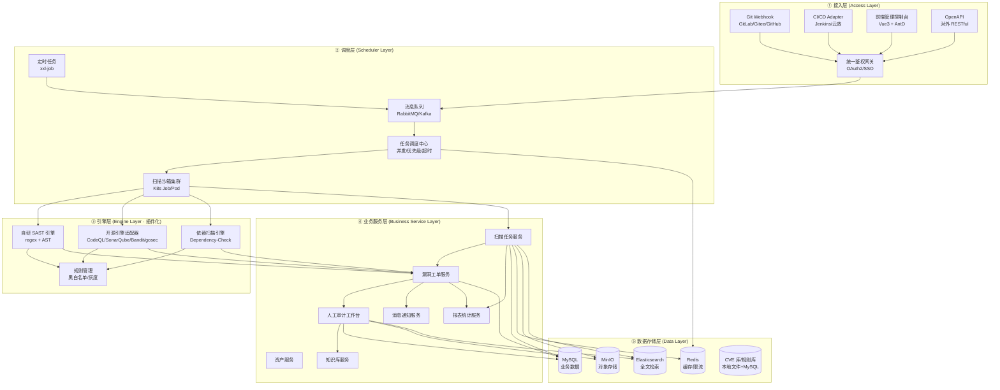

### 5.2 各层职责与技术选型

| 层 | 核心职责 | 关键技术 | 面试常问点 |
|------|----------|----------|------------|
| **① 接入层** | 外部流量接入、鉴权、协议适配 | Nginx 网关、Spring Cloud Gateway、OAuth2、JWT | "为什么用 OAuth2 而不是 Cookie Session？" |
| **② 调度层** | 任务分发、并发控制、沙箱生命周期 | RabbitMQ（任务队列）、xxl-job（定时）、K8s Job（沙箱） | "为什么用消息队列而不是直接调用？" |
| **③ 引擎层** | 多引擎并行扫描、规则管理、结果归一化 | 自研规则引擎、JGit、ANTLR（AST）、ESLint/Pylint 适配 | "多引擎结果怎么去重？" |
| **④ 业务服务层** | 平台所有业务逻辑 | Spring Boot 微服务、领域驱动设计（DDD） | "为什么按业务切分而不是按层切分？" |
| **⑤ 数据存储层** | 异构数据持久化、检索、缓存 | MySQL 8、Redis 7、MinIO、ES 8 | "为什么漏洞全文检索用 ES 而不是 MySQL？" |

---

## 六、核心功能模块详细设计

### 模块 1：代码资产与仓库管理

**核心职责**：仓库接入、授权、分支管理、代码拉取、沙箱隔离。

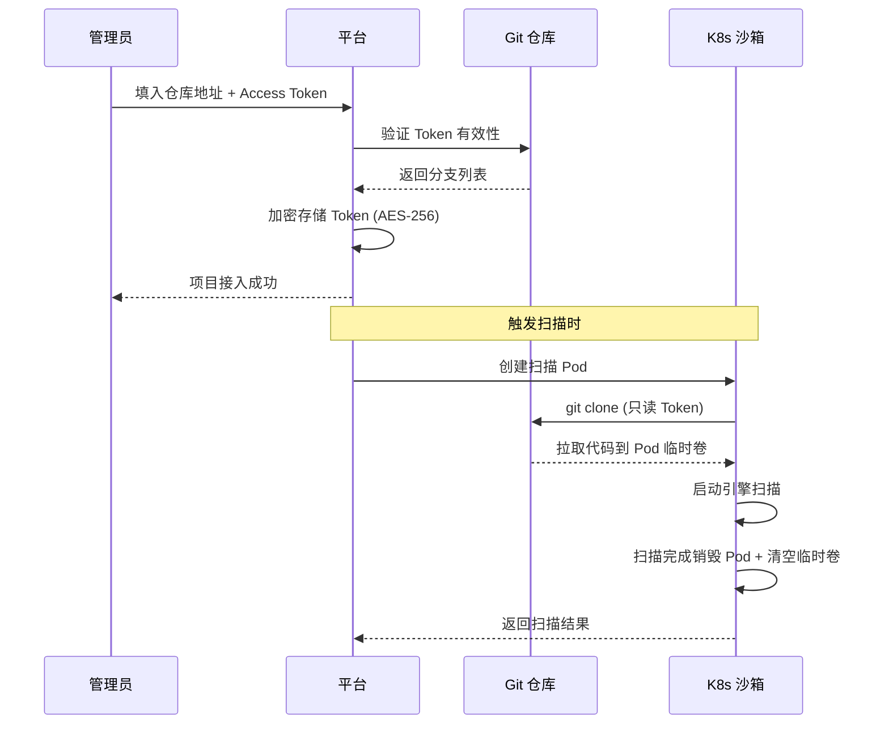

**关键设计**：

1. **Token 加密存储**：使用 AES-256 + KMS 托管密钥，密文存 MySQL
2. **沙箱隔离机制**：
   - 每个项目独立 Pod，网络策略 `NetworkPolicy` 限制仅能与 Git 通信
   - Pod 临时卷使用 `emptyDir`，Pod 删除即销毁
   - 禁止使用 `hostPath` 挂载
3. **拉取模式**：
   - **Webhook 触发**：MR/PR 推送 → 增量 diff 扫描（CI/CD 卡点用）
   - **定时全量**：每日/每周 → 完整分支扫描（合规审计用）
   - **手动触发**：管理员/审计员按需触发

**数据模型（节选）**：

```sql
CREATE TABLE repo (
    id BIGINT PRIMARY KEY,
    name VARCHAR(128),
    platform ENUM('gitlab','gitee','github'),
    url VARCHAR(255),
    access_token_encrypted TEXT,  -- AES-256 加密
    default_branch VARCHAR(64),
    business_line VARCHAR(64),    -- 业务线分组
    owner_id BIGINT,
    status ENUM('active','paused','offline'),
    created_at TIMESTAMP,
    INDEX idx_business_line (business_line)
) ENGINE=InnoDB CHARSET=utf8mb4;
```

---

### 模块 2：多引擎扫描中心

**核心职责**：调度多引擎并行扫描、归一化结果、漏洞去重、可利用性判定。

#### 2.1 扫描模式

| 模式 | 触发场景 | 速度 | 完整度 |
|------|----------|------|--------|
| **增量扫描** | MR/PR 提交 | 30s-2min | 仅检测变更行 ± 50 行上下文 |
| **全量扫描** | 定时任务、首次接入 | 5-10min | 完整代码 + 依赖 |
| **深度扫描** | 高危项目月度审计 | 30min+ | 全量 + 全规则 + 全依赖树分析 |

#### 2.2 引擎调度流程

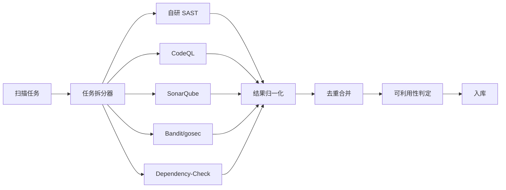

#### 2.3 漏洞结果标准化结构（Union Schema）

```json
{
  "vuln_id": "uuid",
  "project_id": 12345,
  "scan_id": "scan-2024-xxx",
  "engine": "codeql|self_sast|sonar|dependency_check",
  "rule_id": "java/sql-injection-001",
  "title": "SQL 注入风险",
  "severity": "critical|high|medium|low|info",
  "file_path": "src/main/java/com/foo/UserDao.java",
  "line_start": 42,
  "line_end": 45,
  "code_snippet": "String sql = \"SELECT * FROM users WHERE id = \" + userId;",
  "description": "用户输入直接拼接 SQL 语句...",
  "fix_suggestion": "使用 PreparedStatement 参数化查询",
  "cwe": "CWE-89",
  "cve": null,
  "exploitability": "exploitable|potentially_exploitable|not_exploplicable",
  "exploit_reason": "userId 来自 request.getParameter，未做任何校验",
  "engine_raw": { /* 引擎原始结果 */ },
  "discovered_at": "2024-12-15T10:30:00Z"
}
```

#### 2.4 可利用性判定（Exploitability-aware）

> **v1.1 更新**：§ 2.4 描述的伪代码已实现为 M1 可利用性判定引擎（Exploitability Judger）。
> 实现在 `engine/judge/` 包，3 个算法 + 1 个编排器 + 1 个配置 record。

**核心思想**：CVE 库只告诉你"组件有漏洞"，但**代码是否真的调用了漏洞方法、用户输入是否可控**才是关键。

**已实现**（M1）：

1. **代码可达性**（`ReachableAnalyzer`）：
   - 基于 `ProjectCallGraph.getReachable()` BFS 实现
   - 入口识别：Spring MVC 注解（`@RestController` / `@GetMapping` / `@PostMapping` 等）
   - 输出：`boolean` + 可达路径字符串

2. **输入可控性**（`InputControllabilityAnalyzer`）：
   - 直接污染源识别（v1 不做传递追踪）：
     - Spring 注解：`@RequestParam` / `@RequestBody` / `@PathVariable` / `@RequestHeader` / `@CookieValue`
     - HttpServletRequest 方法：`getParameter` / `getHeader` / `getCookies` 等
   - 输出：`boolean` + 具体污染源描述

3. **框架保护**（`FrameworkProtectionDetector`）：
   - YAML 驱动（`engine/src/main/resources/rules/protection/*.yml`）
   - 支持注解类型（ANNOTATION / CLASS_ANNOTATION）和方法调用类型（METHOD_CALL）
   - 内置规则：Spring Security（5 条）、MyBatis（1 条）、Hibernate（1 条）、ESAPI（2 条）
   - 类级注解需要重新解析源文件（v1 实现）

4. **编排器**（`ExploitabilityJudger`）：
   - 4 线程并发执行 3 个算法
   - 单文件超时 5s（可配置）
   - 合成规则：NOT > YES > UNDETERMINED
   - 超时降级为 `POTENTIALLY_EXPLOITABLE`

**已知限制（v1）**：
- 只支持 Java（多语言扩展见 § M2）
- 不做传递数据流追踪（v1 只看直接污染源）
- 类级注解检测需要源文件（要求 ParsedFile 完整传递）
- 性能：100K LOC 扫描约 46s / ~1.9GB（**M1 软阈值 60s / 3GB**（per review-v3 § 6.1 QG-6 降级为 informational），**M1.5 目标 30s / 2GB**（per D7 推 Sprint 3 末启动））

**M2+ 待扩展**：
- 多语言支持（Go / Python / PHP）
- 反射 / 动态代理追踪
- 传递数据流分析（污染传播）
- 自定义数据流源配置

**收益**：把"1000 个 CVE 告警"压缩到"50 个真漏洞"，开发不再被淹没。

#### 2.5 多引擎结果去重算法

**去重 Key = (project_id, file_path, line_start, rule_type)**

```python
def dedup_findings(findings):
    seen = {}
    for f in findings:
        key = (f.project_id, f.file_path, f.line_start, f.rule_type)
        if key in seen:
            # 保留严重度最高的 + 合并引擎来源
            seen[key].engines.update(f.engines)
            if f.severity > seen[key].severity:
                seen[key] = f
        else:
            f.engines = {f.engine}
            seen[key] = f
    return list(seen.values())
```

---

### 模块 3：人工审计工作台（核心差异化）

**核心职责**：人工审计、漏洞标记、POC 录入、修复方案生成、批量处理。

#### 3.1 工作台架构

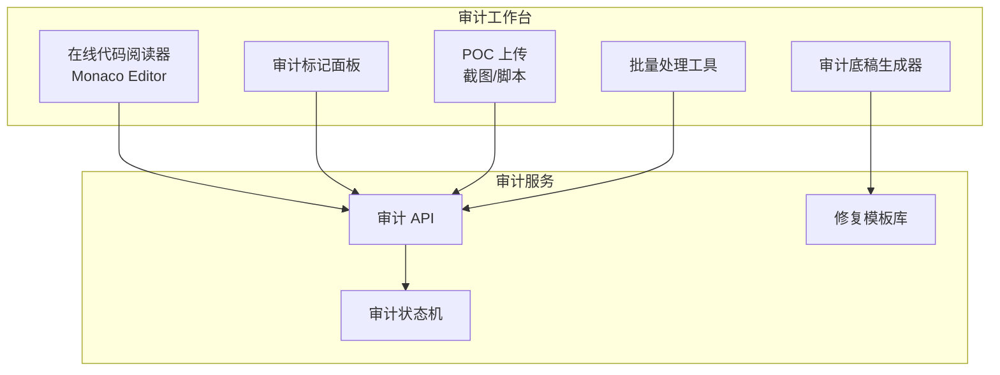

#### 3.2 审计状态机

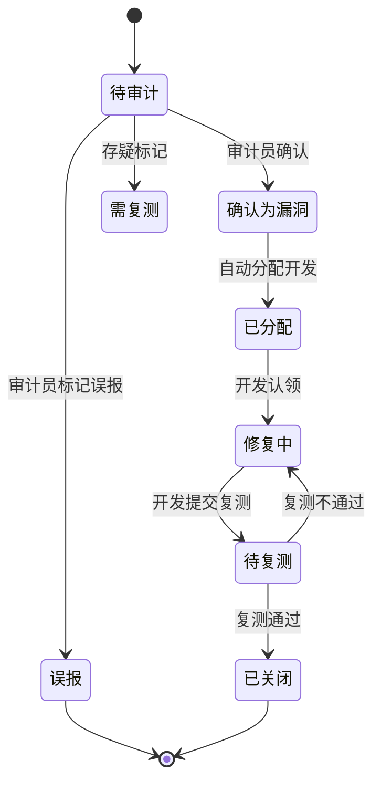

#### 3.3 审计标记数据结构

```sql
CREATE TABLE audit_record (
    id BIGINT PRIMARY KEY,
    vuln_id BIGINT,
    auditor_id BIGINT,
    action ENUM('confirm','false_positive','need_retest'),
    exploit_condition TEXT,        -- 利用条件
    poc_content TEXT,              -- POC 脚本/描述
    poc_screenshot_url VARCHAR(255), -- MinIO 路径
    impact_scope TEXT,             -- 影响范围
    fix_suggestion TEXT,           -- 修复建议
    fix_code_snippet TEXT,         -- 标准修复代码
    audit_duration_seconds INT,    -- 审计耗时
    audited_at TIMESTAMP
);
```

#### 3.4 审计底稿导出（合规用）

平台自动生成包含以下内容的 PDF/HTML 报告：

1. 项目基本信息（业务线、负责人、代码量、扫描时间）
2. 漏洞清单（按严重度倒序）
3. 每条漏洞：位置、原理、POC、影响、修复代码、审计员意见
4. 统计图表（漏洞分布、严重度饼图、修复率）
5. 审计员签名 + 数字签名（防篡改）

**模板引擎**：使用 `Jinja2` + `WeasyPrint`（PDF 渲染）

---

### 模块 4：漏洞工单全生命周期管理

**核心职责**：工单状态流转、责任人绑定、修复期限、豁免审批。

#### 4.1 状态流转

```
待扫描 → 扫描完成(待审计) → 审计确认(待修复) → 修复中
                                              ↓
                                     复测通过(已关闭) / 复测不通过(退回修复)
                                              ↓
                                     合规豁免(归档忽略) ← 中低危可申请
```

#### 4.2 数据模型

```sql
CREATE TABLE vuln_ticket (
    id BIGINT PRIMARY KEY,
    vuln_id BIGINT,                  -- 关联漏洞
    project_id BIGINT,
    status ENUM('pending_scan','pending_audit','pending_fix','fixing',
                'pending_retest','closed','rejected','waived'),
    severity ENUM('critical','high','medium','low'),
    assignee_id BIGINT,              -- 当前处理人
    reporter_id BIGINT,              -- 提单人（审计员）
    deadline DATE,                   -- 修复期限
    fixed_at TIMESTAMP NULL,
    retest_at TIMESTAMP NULL,
    closed_at TIMESTAMP NULL,
    waiver_reason TEXT,              -- 豁免原因
    waiver_approver_id BIGINT,
    created_at TIMESTAMP,
    INDEX idx_assignee_status (assignee_id, status),
    INDEX idx_project_status (project_id, status)
);

CREATE TABLE ticket_history (
    id BIGINT PRIMARY KEY,
    ticket_id BIGINT,
    from_status VARCHAR(32),
    to_status VARCHAR(32),
    operator_id BIGINT,
    comment TEXT,
    operated_at TIMESTAMP,
    INDEX idx_ticket (ticket_id, operated_at)
);
```

#### 4.3 修复期限策略

| 严重度 | 默认期限 | 可配置 |
|--------|----------|--------|
| Critical | 24 小时 | ✅ |
| High | 7 天 | ✅ |
| Medium | 30 天 | ✅ |
| Low | 90 天 | ✅ |

超期自动触发：邮件 + 钉钉 + 企业微信 + 抄送项目负责人

---

### 模块 5：CI/CD 流水线安全卡点

**核心职责**：MR/PR 增量扫描、卡点策略、结果回传、阻断放行。

#### 5.1 流水线集成流程

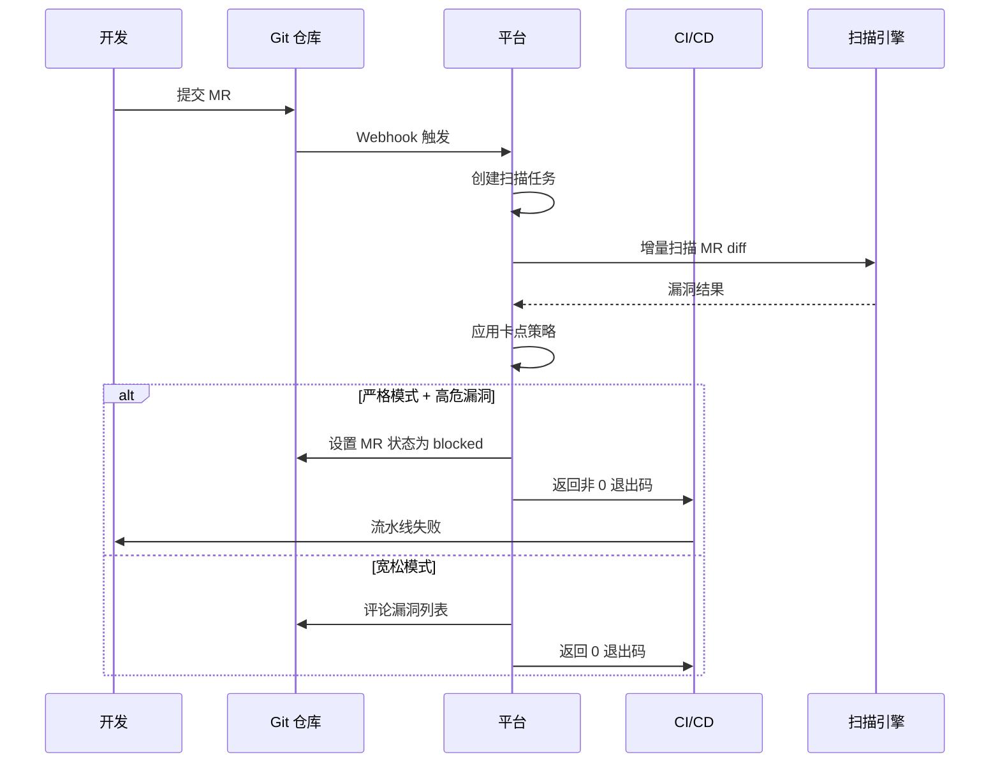

#### 5.2 卡点策略配置

```json
{
  "strategy_name": "严格模式 V1",
  "project_id": 12345,
  "rules": [
    {"severity": "critical", "block": true, "sla_hours": 24},
    {"severity": "high", "block": true, "sla_hours": 168},
    {"severity": "medium", "block": false, "sla_hours": 720},
    {"severity": "low", "block": false, "sla_hours": 2160}
  ],
  "exceptions": {
    "files": ["test/**", "**/*Test.java"],
    "rules": ["java/hardcoded-password-001"]
  }
}
```

#### 5.3 GitLab MR 评论机器人

平台在 MR 上自动发布评论：

> 🔒 **安全扫描完成**  
> 扫描 ID：`scan-2024-xxx`  
> 发现漏洞：**3 高危、5 中危、2 低危**  
>
> - 🔴 [SQL 注入] `src/UserDao.java:42` → [查看详情](https://platform/vuln/123)
> - 🔴 [硬编码密钥] `src/Config.java:18` → [查看详情](https://platform/vuln/124)
>
> **当前状态：⛔ 阻断合并**  
> 修复指引：[安全编码规范](https://platform/kb/sql-injection-fix)

---

### 模块 6：规则与误报管理

**核心职责**：规则库维护、误报白名单、规则灰度、自定义规则。

#### 6.1 规则结构

```yaml
# 规则元数据
id: java/sql-injection-001
name: SQL 注入 - 字符串拼接
severity: high
cwe: CWE-89
languages: [java]
engine: self_sast
# 检测逻辑
detection:
  type: ast
  pattern: |
    String sql = "..." + userInput
# 修复建议
fix:
  description: 使用 PreparedStatement 参数化
  example: |
    PreparedStatement ps = conn.prepareStatement("SELECT * FROM users WHERE id = ?");
    ps.setString(1, userId);
# 误报场景
false_positive_scenarios:
  - framework: spring-jdbc
    reason: NamedParameterJdbcTemplate 已自动转义
# 元信息
author: security-team
created_at: 2024-01-15
enabled: true
gray_release: false
```

#### 6.2 规则灰度发布流程

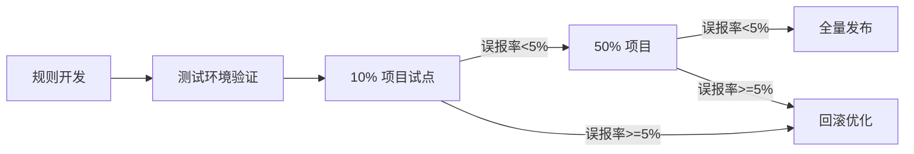

#### 6.3 误报白名单

```sql
CREATE TABLE false_positive_whitelist (
    id BIGINT PRIMARY KEY,
    project_id BIGINT,
    rule_id VARCHAR(64),
    file_pattern VARCHAR(255),     -- 支持 glob
    line_range VARCHAR(32),         -- 如 "100-120"
    reason TEXT,                   -- 忽略原因
    operator_id BIGINT,
    expires_at TIMESTAMP NULL,      -- 过期时间（默认 1 年）
    created_at TIMESTAMP
);
```

---

### 模块 7：风险大盘与报表中心

**核心职责**：实时大盘、月度报表、合规导出、趋势分析。

#### 7.1 实时大盘指标

| 指标 | 计算方式 | 展示形式 |
|------|----------|----------|
| 项目总数 | COUNT(repo WHERE status=active) | 大数字 |
| 漏洞总数 | COUNT(vuln WHERE status IN (open)) | 大数字 + 严重度分布饼图 |
| 高危占比 | COUNT(severity=critical AND status=open) / 总数 | 百分比 |
| 本周新增/修复 | 聚合 7 天 | 趋势折线图 |
| 整改率 | closed / (closed + open) | 进度条 |
| 平均修复周期 | AVG(closed_at - discovered_at) | 天数 |
| 各业务线评分 | 自定义评分算法（漏洞数 × 权重） | 排行榜 |

#### 7.2 月度合规报告

**自动生成**，每月 1 号凌晨 2 点触发：

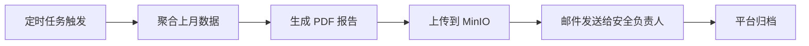

**报告目录结构**：

```
月度报告_202412/
├── 01_全局安全态势.pdf
├── 02_业务线安全排行.pdf
├── 03_新增漏洞清单.pdf
├── 04_已修复漏洞清单.pdf
├── 05_逾期未修复清单.pdf
├── 06_规则执行情况.pdf
└── raw_data/  # 原始数据
    ├── vulns.csv
    ├── projects.csv
    └── metrics.json
```

#### 7.3 安全评分算法

```python
def calculate_security_score(project):
    score = 100
    vulns = get_open_vulns(project.id)

    # 漏洞数扣分
    for v in vulns:
        score -= SEVERITY_WEIGHT[v.severity]  # critical=-20, high=-10, medium=-3, low=-1

    # 整改率加分
    fix_rate = get_fix_rate(project.id)
    score += fix_rate * 10  # 满分 10 分

    # 扫描覆盖率
    coverage = get_scan_coverage(project.id)
    if coverage < 0.8:
        score -= 5

    return max(0, min(100, score))
```

---

### 模块 8：用户权限体系（RBAC）

**核心职责**：角色管理、权限控制、操作审计。

#### 8.1 角色矩阵

| 角色 | 资产管理 | 扫描任务 | 审计操作 | 工单操作 | 规则管理 | 报表查看 |
|------|----------|----------|----------|----------|----------|----------|
| **超级管理员** | CRUD | CRUD | CRUD | CRUD | CRUD | ✅ |
| **安全审计员** | R | CRUD | CRUD | R | R | ✅ |
| **项目负责人** | R (本业务线) | R | R | CRUD (本项目) | R | ✅ (本项目) |
| **开发人员** | R (负责项目) | R | R | RUD (负责工单) | ❌ | R (负责项目) |
| **只读访客** | R | R | R | R | R | ✅ |

#### 8.2 数据模型

```sql
CREATE TABLE user (
    id BIGINT PRIMARY KEY,
    username VARCHAR(64) UNIQUE,
    email VARCHAR(128),
    role_id BIGINT,
    business_line VARCHAR(64),    -- 数据权限范围
    status ENUM('active','disabled'),
    created_at TIMESTAMP
);

CREATE TABLE role (
    id BIGINT PRIMARY KEY,
    name VARCHAR(64),
    permissions JSON,              -- ['repo:create', 'scan:trigger', ...]
    description TEXT
);

CREATE TABLE operation_log (
    id BIGINT PRIMARY KEY,
    user_id BIGINT,
    action VARCHAR(64),            -- 'create_repo', 'audit_vuln', etc.
    resource_type VARCHAR(32),
    resource_id VARCHAR(64),
    ip_address VARCHAR(45),
    user_agent TEXT,
    request_payload TEXT,
    result ENUM('success','failure'),
    operated_at TIMESTAMP,
    INDEX idx_user_time (user_id, operated_at),
    INDEX idx_resource (resource_type, resource_id)
);
```

**审计日志合规要求**：保留 ≥ 1 年，防篡改（追加写 + 数字签名）。

---

## 七、数据模型设计（ER 概览）

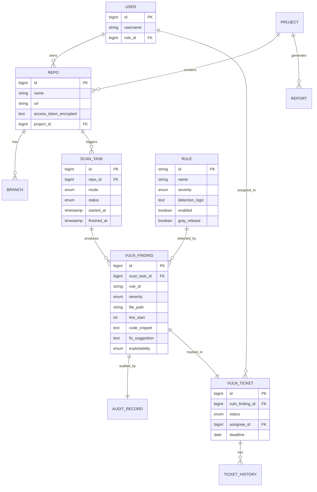

---

## 八、核心 API 契约（节选）

### 8.1 仓库接入

```http
POST /api/v1/repos
Content-Type: application/json
Authorization: Bearer {token}

{
  "name": "user-service",
  "platform": "gitlab",
  "url": "https://gitlab.example.com/backend/user-service.git",
  "access_token": "glpat-xxxxx",
  "business_line": "支付业务",
  "default_branch": "main"
}

Response 200:
{
  "id": 12345,
  "name": "user-service",
  "branches": ["main", "develop", "feature/x"],
  "status": "active"
}
```

### 8.2 触发扫描

```http
POST /api/v1/scans
{
  "repo_id": 12345,
  "mode": "incremental",  // incremental | full | deep
  "branch": "feature/x",
  "commit_sha": "abc123",
  "engines": ["self_sast", "codeql", "dependency_check"]
}

Response 202:
{
  "scan_id": "scan-20241215-001",
  "status": "queued",
  "estimated_duration_seconds": 180
}
```

### 8.3 查询漏洞列表

```http
GET /api/v1/vulns?project_id=12345&severity=high&status=open&page=1&size=20
Authorization: Bearer {token}

Response 200:
{
  "total": 156,
  "items": [
    {
      "id": 999,
      "rule_id": "java/sql-injection-001",
      "title": "SQL 注入风险",
      "severity": "high",
      "file_path": "src/main/java/.../UserDao.java",
      "line_start": 42,
      "exploitability": "exploitable",
      "status": "open",
      "discovered_at": "2024-12-15T10:30:00Z"
    }
  ]
}
```

### 8.4 审计提交

```http
POST /api/v1/audits
{
  "vuln_id": 999,
  "action": "confirm",  // confirm | false_positive | need_retest
  "exploit_condition": "userId 来自 URL 参数，未做任何校验",
  "poc_content": "GET /user?id=1' OR '1'='1",
  "impact_scope": "全站用户信息泄露",
  "fix_suggestion": "使用 PreparedStatement",
  "fix_code_snippet": "PreparedStatement ps = ..."
}
```

### 8.5 CI/CD 状态回调

```http
POST {ci_callback_url}
{
  "scan_id": "scan-20241215-001",
  "status": "completed",
  "summary": {
    "critical": 0,
    "high": 3,
    "medium": 5,
    "low": 2
  },
  "block": true,
  "report_url": "https://platform/reports/scan-20241215-001",
  "mr_comment_url": "https://gitlab.example.com/.../merge_requests/42#note-1"
}
```

---

## 九、关键业务流程（时序图）

### 9.1 端到端扫描流程

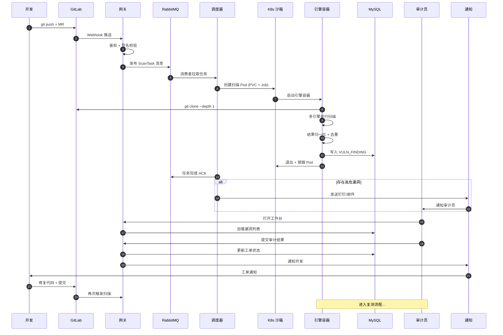

### 9.2 漏洞状态机流转

参见「模块 4 工单管理」状态机。

---

## 十、部署架构

### 10.1 整体部署拓扑

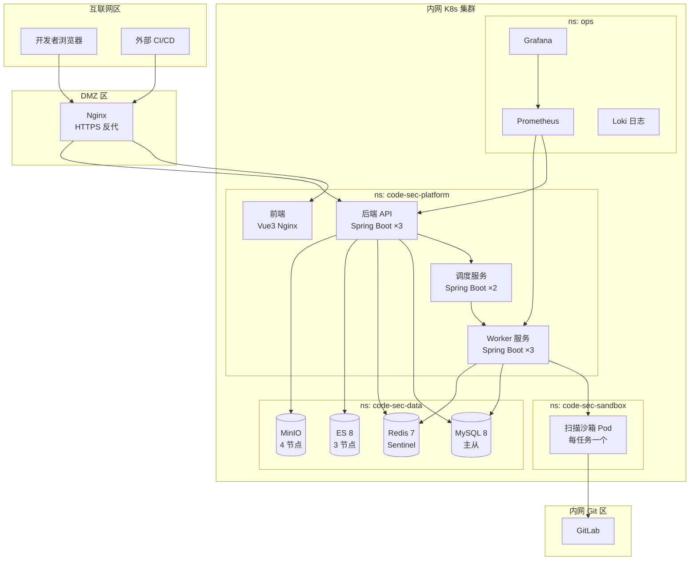

### 10.2 K8s 资源规划

| 资源 | 副本数 | CPU | 内存 | 存储 | 备注 |
|------|--------|-----|------|------|------|
| MySQL | 1 主 + 2 从 | 8 | 16G | 500G SSD | 主从复制 |
| Redis | 1 主 + 2 从 | 4 | 8G | 50G | Sentinel 监控 |
| Elasticsearch | 3 节点 | 8 | 16G | 1T ×3 | 每节点独立 |
| MinIO | 4 节点 | 4 | 8G | 4T ×4 | 纠删码 EC:4 |
| API 服务 | 3 副本 | 4 | 8G | - | HPA 自动扩缩 |
| Worker 服务 | 3 副本 | 8 | 16G | - | 与沙箱解耦 |
| 沙箱 Pod | 按需 | 2 | 4G | emptyDir | 任务结束即销毁 |

### 10.3 沙箱安全策略

```yaml
# 1. NetworkPolicy：仅允许访问 Git 仓库
apiVersion: networking.k8s.io/v1
kind: NetworkPolicy
metadata:
  name: sandbox-isolation
  namespace: code-sec-sandbox
spec:
  podSelector: {}
  policyTypes: [Egress]
  egress:
    - to:
        - namespaceSelector:
            matchLabels:
              name: gitlab
      ports:
        - protocol: TCP
          port: 443
    - to:  # DNS
        - namespaceSelector: {}
      ports:
        - protocol: UDP
          port: 53

# 2. PodSecurityPolicy：禁止特权
apiVersion: policy/v1beta1
kind: PodSecurityPolicy
metadata:
  name: sandbox-restricted
spec:
  privileged: false
  allowPrivilegeEscalation: false
  runAsNonRoot: true
  readOnlyRootFilesystem: true
  capabilities:
    drop: [ALL]
```

---

## 十一、技术选型与理由

### 11.1 后端技术栈

| 组件 | 选型 | 理由 |
|------|------|------|
| **主语言** | Java 17 + Spring Boot 3 | 生态成熟、安全团队熟悉、内存安全 |
| **辅助语言** | Python 3.11（自研 SAST 引擎） | AST 库丰富（tree-sitter、javalang） |
| **微服务框架** | Spring Cloud Alibaba | Nacos 注册中心、Sentinel 限流 |
| **API 网关** | Spring Cloud Gateway | 响应式、动态路由 |
| **消息队列** | RabbitMQ | 任务可靠性投递、延迟队列、镜像集群 |
| **任务调度** | xxl-job | 分布式定时任务、运维友好 |

### 11.2 引擎技术栈

| 引擎 | 用途 | 备注 |
|------|------|------|
| **自研 SAST** | 通用业务漏洞 | tree-sitter（多语言 AST） + 自定义规则 |
| **CodeQL** | 深度语义分析 | 适合 Java/JS/Python 复杂漏洞 |
| **SonarQube** | 代码质量 + 基础漏洞 | 自托管 Community 版 |
| **Bandit** | Python 专项 | 轻量、CWE 覆盖好 |
| **gosec** | Go 专项 | 官方维护 |
| **Dependency-Check** | 依赖漏洞 | OWASP 开源、CVE 库完整 |

> **v1.1 引擎栈确认**：组合 = **自研 SAST（M1）+ CodeQL（M2）+ Dependency-Check（M2）**。自研 SAST 在 M1 完成 Java 单语言；CodeQL 与 Dependency-Check 在 M2 接入，CodeQL 商用 License 已由法务确认无限制。

### 11.3 数据存储

| 数据 | 存储 | 理由 |
|------|------|------|
| 业务数据 | MySQL 8 | 强事务、外键约束 |
| 缓存/限流 | Redis 7 | 高性能、TTL 原生 |
| 对象存储 | MinIO | S3 兼容、私有化、纠删码 |
| 全文检索 | Elasticsearch 8 | 漏洞/代码片段/日志检索 |
| 规则库 | Git + MySQL | 版本化管理、灰度发布 |

### 11.4 前端技术栈

| 组件 | 选型 | 理由 |
|------|------|------|
| 框架 | Vue 3 + TypeScript | 国内生态成熟 |
| UI 库 | Ant Design Vue | 中后台标配 |
| 代码编辑器 | Monaco Editor | VSCode 同款、语法高亮 |
| 图表 | ECharts | 国产、大数据量友好 |
| 构建 | Vite | 启动快、HMR 流畅 |

---

## 十二、非功能性设计

### 12.1 性能指标 & 达成方案

| 指标 | 目标 | 方案 |
|------|------|------|
| **单项目 10 万行 ≤ 10min** | 必达 | 引擎并行 + 增量缓存 + AST 复用 |
| **并发扫描 ≥ 50 任务** | 必达 | K8s HPA + RabbitMQ 预取 + Worker 池 |
| **API 响应 P99 < 500ms** | 必达 | Redis 缓存热点 + ES 检索 + DB 索引 |
| **扫描结果入库 < 5s** | 必达 | 批量写 + 异步落库 |

### 12.2 可用性

- **SLO**: 99.9%（年度停机 < 8.76 小时）
- **多副本**：所有无状态服务 ≥ 3 副本
- **数据多副本**：MySQL 主从、ES 三节点、MinIO 纠删码 EC:4
- **优雅降级**：单引擎失败不影响其他引擎结果

### 12.3 安全设计

| 维度 | 设计 |
|------|------|
| **代码隔离** | K8s 沙箱 + NetworkPolicy + 临时卷销毁 |
| **Token 加密** | AES-256 + KMS 密钥管理 |
| **平台鉴权** | OAuth2 + JWT + RBAC |
| **操作审计** | 全量日志 + 追加写 + 数字签名 |
| **传输加密** | TLS 1.3 全链路 |
| **存储加密** | MySQL TDE、MinIO SSE-S3 |
| **漏洞响应** | 内部 CVE 跟进机制、SLA 24h 修复 |

### 12.4 可扩展性

- **引擎插件化**：标准引擎适配器接口，新增引擎只需实现适配器
- **语言插件化**：tree-sitter grammar 包即插即用
- **规则插件化**：规则定义 YAML 化，支持热加载
- **存储插件化**：抽象 Repository 层，支持替换 ES/OpenSearch

### 12.5 可观测性

```yaml
# 三大支柱
metrics:
  - Prometheus + Grafana
  - 关键指标: scan_duration_seconds, queue_depth, vuln_count_by_severity

logs:
  - Loki + Promtail
  - 结构化 JSON 日志，trace_id 全链路

traces:
  - Jaeger / SkyWalking（可选）
  - 跨服务调用链追踪
```

---

## 十三、MVP 范围 / Not Doing

### 13.1 MVP 范围（M1：3 个月内交付）

✅ **必须做**：

1. 仓库接入（GitLab）+ Webhook 触发
2. 自研 SAST 引擎（Java 语言起步）
3. 人工审计工作台（标记、POC、修复建议）
4. 漏洞工单管理（核心状态流转）
5. RBAC 权限（4 个核心角色）
6. 基础大盘（项目数、漏洞数、Top 10）
7. 单一部署形态：Docker Compose（K8s 后续）

❌ **Not Doing（MVP 不做）**：

| 不做的事 | 原因 |
|----------|------|
| 多语言支持 | 优先 Java，验证模式后再扩展 |
| 全引擎集成 | 自研 SAST 先跑通，CodeQL/Dependency-Check M2 再加 |
| 复杂报表 | MVP 只出基础统计，复杂报表 M3 |
| 知识库 | 沉淀功能后期做，MVP 专注核心闭环 |
| 沙箱 K8s Job | MVP 用 Docker 沙箱，简化运维 |
| 规则灰度 | 直接全量，灰度机制 M3 加 |
| 第三方 CI/CD 深度集成 | MVP 只做 GitLab Webhook 通用模式 |

### 13.2 完整路线图

| 里程碑 | 时间 | 交付内容 |
|--------|------|----------|
| **M1 MVP** | T+8 周 | 4 个 Sprint，基础平台 + 自研 SAST + 工单 + 审计工作台（Java 单语言、Docker 部署） |
| **M2 引擎扩展** | T+14 周 | 接入 CodeQL + Dependency-Check、覆盖 5 语言、K8s 沙箱 |
| **M3 报表+知识库** | T+20 周 | 月度报告自动生成、规则灰度发布、知识库 MVP |
| **M4 商业化准备** | T+26 周 | 第三方 CI 深度集成、OpenAPI 平台 |
| **M5 商业化** | T+36 周 | 多租户、计费、API 开放平台 |

---

## 十四、实施路线图（详细）

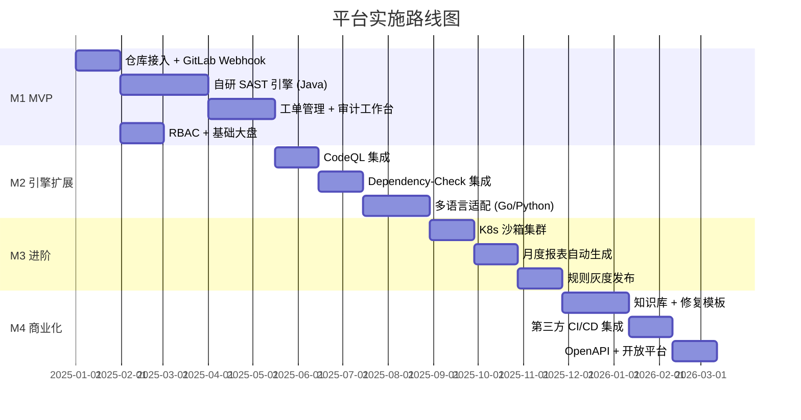

---

## 十五、风险与对策

| 风险 | 等级 | 描述 | 对策 |
|------|------|------|------|
| **R1 自研 SAST 引擎误报率高** | 高 | regex 规则天然误报多 | AST + 数据流分析；项目级白名单；人工审计前置 |
| **R2 客户代码泄露** | 极高 | 一旦泄露，平台信誉崩溃 | 沙箱隔离 + 临时卷销毁 + Token 加密 + 全链路审计 |
| **R3 扫描性能不达标** | 中 | 10 万行 10 分钟压力大 | 增量扫描 + 缓存复用 + 引擎并行 + 水平扩容 |
| **R4 CVE 库更新滞后** | 中 | 0day 漏洞无法及时发现 | 订阅 NVD 源 + 每日同步 + 紧急规则加急通道 |
| **R5 业务方抵触** | 中 | 误报导致开发拒绝使用 | 严格模式可配置 + 漏洞分级展示 + POC + 修复代码 |
| **R6 商业引擎 License 风险** | 中 | CodeQL 限制商用 | 法务前置 + 商业引擎 + 开源引擎双轨 |
| **R7 人员能力不足** | 中 | AST/CodeQL 学习曲线陡 | 培训 + 外部专家 + 渐进式引入 |

---

## 附录 A：面试高频追问 Q&A

**Q1：为什么用消息队列而不是直接 HTTP 调用？**  
A：解耦 + 削峰 + 可靠性。HTTP 同步调用在并发上来时容易把调度服务打挂，MQ 天然支持任务堆积和失败重试。

**Q2：怎么保证沙箱里代码不泄露？**  
A：三层防御：(1) NetworkPolicy 限制仅出向 Git；(2) emptyDir 临时卷 Pod 销毁即清空；(3) 引擎容器以非 root 跑、只读根文件系统。

**Q3：多引擎结果怎么去重？**  
A：以 (project_id, file_path, line_start, rule_type) 为 key，保留严重度最高的 + 合并引擎来源。

**Q4：自研 SAST 引擎怎么避免误报？**  
A：(1) 优先用 AST 不用纯 regex；(2) 框架适配规则（Spring/MyBatis 安全的 API 自动豁免）；(3) 项目级白名单；(4) 人工审计前置过滤。

**Q5：怎么解决业务逻辑漏洞扫不出来？**  
A：自动化只解决 30% 漏洞，剩下的靠：(1) 人工审计工作台；(2) 标准化检查清单；(3) 漏洞样本库匹配；(4) 把高频逻辑漏洞逐步自动化。

**Q6：CVE 漏洞这么多，怎么避免开发被淹没？**  
A：可利用性判定 + 分级展示。真正"代码调用了漏洞方法 + 输入可控"才推给开发，否则只在大盘上展示。

**Q7：10 万行 10 分钟怎么做到？**  
A：(1) 增量扫描只扫 diff；(2) 已扫描代码片段缓存复用；(3) 多引擎并行；(4) 关键模块优先扫描；(5) K8s 横向扩容。

**Q8：为什么不用 SonarQube 现成的？**  
A：SonarQube 主要做代码质量，安全只是附加功能。本平台深度定制：审计工作台、可利用性判定、CI/CD 强卡点、合规报表，SonarQube 都做不了。

---

## 附录 B：与原文档的差异说明

本文档在原《安全代码审计平台全套设计方案》基础上做了以下**实质性扩展**：

1. **新增数据模型章节**：将 8 个模块的核心表结构全部用 SQL 表达
2. **新增 API 契约章节**：5 个核心 REST API 的请求/响应结构
3. **新增时序图章节**：端到端扫描流程、MR 触发流程
4. **新增部署架构章节**：K8s 拓扑图、资源规划、NetworkPolicy 完整配置
5. **新增技术选型理由**：每个组件的选择都有"为什么是这个"的论证
6. **新增非功能性设计**：性能/可用性/安全/可扩展/可观测性 5 维度
7. **新增 MVP / Not Doing**：明确砍掉什么，留什么
8. **新增实施路线图**：5 个里程碑的甘特图
9. **新增风险与对策**：7 个核心风险 + 缓解措施
10. **新增面试 Q&A**：8 个高频追问的参考回答

---

**文档结束**

> 本文档已为面试答辩优化，建议准备时长 15-20 分钟口述版本，重点突出 ① 五层架构 ② 沙箱隔离 ③ 可利用性判定 ④ 审计工作台 ⑤ MVP 范围 这五个亮点。
