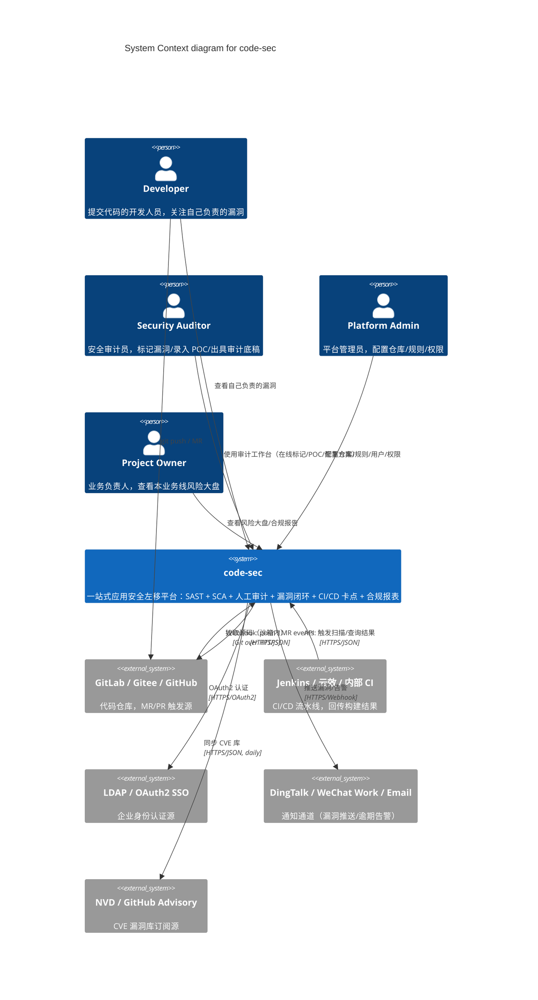
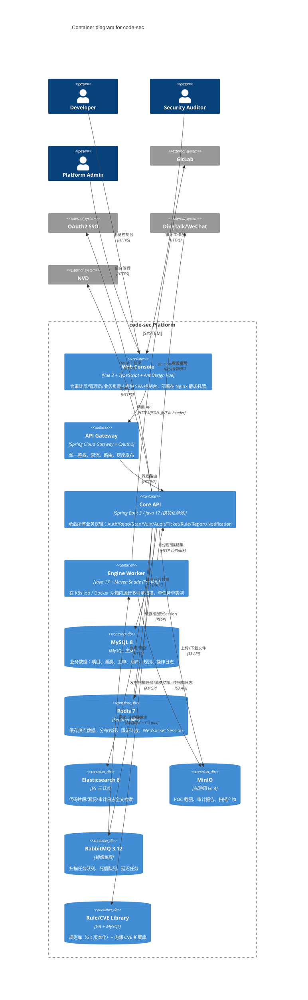
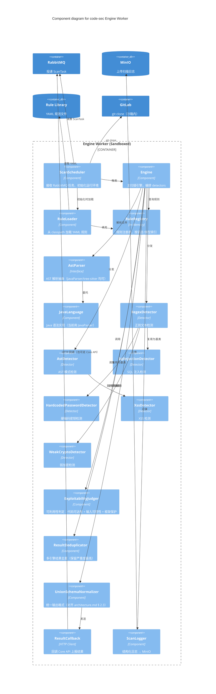

# code-sec — C4 架构模型

> **文档版本**: v1.0  
> **适用场景**: 架构评审、技术分享、团队培训、新成员 onboarding  
> **框架**: C4 model by Simon Brown (https://c4model.com)  
> **配套文档**: `architecture.md`（5 层架构 + 详细设计）

---

## 0. 为什么是 C4

| 维度 | 原 5 层架构 | C4 Model |
|------|------------|----------|
| 抽象层级 | 5 个固定分层 | **4 个递进层级**（Context→Container→Component→Code） |
| 表达形式 | 文字 + 1 张大图 | **每层独立图 + 文字说明** |
| 读者路径 | 一锅烩 | 层层下钻，按需展开 |
| 边界定义 | 隐式 | **显式画出系统边界**，标注外部系统 |

> **核心差异**：C4 的第一层（System Context）强制回答"**系统之外还有什么**"——这恰好是软件架构最常被忽视的盲区：谁在用、和谁交互、依赖哪些外部服务。

---

## 一、C4 模型与原 5 层架构的映射

| 原 5 层架构 | C4 层级 | 重点 |
|------------|---------|------|
| ① 接入层 | **Level 1 Context** | 用户、外部系统、协议 |
| ① 接入层 + ② 调度层 | **Level 2 Container** | 进程、数据库、消息队列、运行时容器 |
| ③ 引擎层 + ④ 业务服务层 | **Level 3 Component** | 容器内的模块、Controller、Service、领域对象 |
| ③ 引擎层核心类 | **Level 4 Code** | 关键算法、数据结构、接口契约 |
| ⑤ 数据存储层 | 跨 Level 2/3 | Container 层画存储，Component 层画 ORM 映射 |

---

## 二、Level 1 — System Context（系统上下文）

> **核心问题**：`code-sec` 是一个黑盒，它和谁交互、对外提供什么能力、依赖哪些外部系统？

### 2.1 System Context 图



### 2.2 参与者清单

| 角色 | 缩写 | 主要使用场景 | 关注指标 |
|------|------|--------------|----------|
| **Developer** | DEV | MR 推送后查看扫描结果、修复高危漏洞 | 漏洞响应时长 |
| **Security Auditor** | AUD | 日常审计工作台使用、批量标记、复测 | 日均处理漏洞数 |
| **Platform Admin** | ADM | 接入新仓库、调整规则、用户管理 | 系统可用性 |
| **Project Owner** | OWN | 月度汇报、合规审计、风险决策 | 业务线安全评分 |

### 2.3 外部系统清单

| 外部系统 | 协议 | 方向 | 关键交互 |
|----------|------|------|----------|
| **GitLab/Gitee/GitHub** | Git + Webhook | 双向 | 拉源码（沙箱内）+ 接收 MR 事件 |
| **Jenkins/云效** | HTTPS/JSON | 双向 | 接收构建触发 + 回传扫描结论 |
| **LDAP/OAuth2 SSO** | OAuth2 | 出 | 登录认证（OIDC 流程） |
| **DingTalk/WeChat/Email** | HTTPS Webhook | 出 | 漏洞推送、逾期告警、审计通知 |
| **NVD/GHSA** | HTTPS/JSON | 出 | 每日增量同步 CVE 库 |

### 2.4 关系矩阵

| From | To | 协议 | 频率 | SLA |
|------|-----|------|------|-----|
| GitLab | code-sec | Webhook | MR/push 时触发 | < 1s 接收 |
| code-sec | GitLab | Git clone | 每次扫描 | < 30s（增量） |
| Jenkins | code-sec | REST API | 每次构建 | < 500ms 响应 |
| code-sec | SSO | OAuth2 | 登录时 | < 1s |
| code-sec | Notify | Webhook | 事件触发 | < 3s 推送 |
| code-sec | NVD | HTTPS | 每日 02:00 | 异步 |

### 2.5 本层设计要点

- **4 类用户角色**：开发、审计员、管理员、业务负责人，关注指标各不相同
- **5 类外部系统**：Git（双向同步）、CI/CD（双向 API）、SSO（单向出）、Notify（单向出）、NVD（单向出）
- **核心安全设计**：所有源码拉取都发生在沙箱内部，平台对外不持久化业务代码——这是合规底线

---

## 三、Level 2 — Container（容器）

> **核心问题**：`code-sec` 这个黑盒里面到底跑着哪些**进程/服务/数据存储**？它们用什么技术栈？怎么通信？

### 3.1 Container 图



### 3.2 容器清单

| 容器 | 技术栈 | 副本数 | 资源 | 关键职责 |
|------|--------|--------|------|----------|
| **Web Console** | Vue 3 + Vite + AntD | 3 + CDN | 0.5 CPU / 256MB | SPA，Nginx 静态托管 |
| **API Gateway** | Spring Cloud Gateway | 3 | 1 CPU / 1G | OAuth2 + 限流 + 路由 + 灰度 |
| **Core API** | Spring Boot 3 + Java 17 | 3 (HPA 5) | 4 CPU / 8G | 所有业务逻辑（模块化单体） |
| **Engine Worker** | Java 17 + Maven Shade | 按需 (1-50) | 2 CPU / 4G | 多引擎扫描，每任务一实例 |
| **MySQL** | MySQL 8.0 | 1 主 + 2 从 | 8 CPU / 16G / 500G SSD | 业务数据主存储 |
| **Redis** | Redis 7 | 1 主 + 2 从 | 4 CPU / 8G | 缓存/限流/分布式锁 |
| **Elasticsearch** | ES 8 | 3 节点 | 8 CPU / 16G / 1T×3 | 全文检索 |
| **MinIO** | MinIO | 4 节点 | 4 CPU / 8G / 4T×4 | 对象存储 |
| **RabbitMQ** | RabbitMQ 3.12 | 3 节点镜像 | 2 CPU / 4G | 任务队列 |
| **Rule/CVE Library** | Git + MySQL | 主备 | 0.5 CPU / 1G | 规则库 + CVE 扩展 |

### 3.3 关系矩阵

| From | To | 协议 | 同步/异步 | 失败处理 |
|------|-----|------|----------|----------|
| Web | Gateway | HTTPS/JSON | 同步 | 重试 + 降级 |
| Gateway | Core API | HTTP/2 | 同步 | 熔断 + 降级 |
| Core API | MySQL | JDBC | 同步 | 连接池 + 重试 |
| Core API | Redis | RESP | 同步 | 失败降级到 DB |
| Core API | ES | HTTP | 同步 | 失败降级到 MySQL LIKE |
| Core API | MinIO | S3 API | 同步 | 重试 + 断点续传 |
| Core API | RabbitMQ | AMQP | 异步 | 持久化 + DLX |
| RabbitMQ | Engine Worker | AMQP | 异步 | ACK + 重投 |
| Engine Worker | GitLab | Git | 同步 | 重试 + 超时 |
| Engine Worker | Core API | HTTP | 同步 | 回调 + 重试 |

### 3.4 关键架构决策（ADR-Lite）

#### ADR-01：为什么 Core API 用模块化单体而不是微服务？

| 备选 | 优点 | 缺点 | 决策 |
|------|------|------|------|
| 整体 SOA（10+ 微服务） | 独立扩缩、技术异构 | 运维复杂、分布式事务、调试难 | ❌ |
| **模块化单体** | 部署简单、事务一致、IDE 友好 | 单点扩缩（用 HPA 缓解） | ✅ |
| 渐进式拆分（先单体后微服务） | 演进式 | 前期技术债务 | 备选 |

> **10 人团队的核心约束**：微服务的运维成本远超 10 人能承受。模块化单体保留清晰边界，未来可按域拆分。

#### ADR-02：为什么 Engine Worker 是独立进程而不是 Core API 内的库？

| 备选 | 优点 | 缺点 | 决策 |
|------|------|------|------|
| 库内嵌调用 | 简单 | 无法沙箱隔离、源码泄露风险 | ❌ |
| **独立 Worker + 消息队列** | 沙箱隔离、横向扩容、语言无关 | 增加运维 | ✅ |
| Sidecar 模式 | 同 Pod 隔离 | 资源竞争、调度复杂 | 备选 |

> **核心动因**：源码隔离。Worker 跑在 K8s Job 沙箱里，emptyDir 临时卷，Pod 销毁即清空。Core API 永远不接触业务源码。

#### ADR-03：为什么用 MySQL 而不是 PostgreSQL？

- 团队 MySQL 经验成熟
- 私有化部署客户多为 MySQL
- 后期可平滑迁移到 TiDB（MySQL 协议兼容）

#### ADR-04：为什么引入 MinIO 而不是直接用 NFS？

- 对象存储天然适合 POC 截图、扫描日志
- S3 协议生态丰富（boto3、aws-sdk 可用）
- 纠删码 EC:4 比 3 副本节省 33% 存储
- 未来可平滑迁移到 S3/OSS/COS

#### ADR-05：为什么用 RabbitMQ 而不是 Kafka？

| 维度 | RabbitMQ | Kafka | 选型 |
|------|----------|-------|------|
| 消息可靠性投递 | 强（confirm 机制） | 中（offset 提交） | ✅ |
| 延迟队列 | 原生支持 | 需自行实现 | ✅ |
| 死信队列 | 原生支持 | 不支持 | ✅ |
| 单消息延迟 | μs 级 | ms 级 | ✅ |
| 吞吐量 | 万级 TPS | 百万级 TPS | 任务场景足够 |
| 消息保留 | 即时消费 | 持久化保留（可重放） | ❌ 不需要重放 |

> **结论**：任务调度场景，RabbitMQ 全胜。Kafka 的优势（日志聚合、流式处理）在事件溯源场景才有价值。

### 3.5 本层设计要点

- **10 个容器分 4 类**：
  - 接入层：Vue Web Console + Spring Cloud Gateway
  - 应用层：Core API（模块化单体）+ Engine Worker（独立进程）
  - 数据层：MySQL + Redis + ES + MinIO + RabbitMQ
  - 资产层：Rule/CVE 库
- **三个核心决策**：
  1. Core API 用模块化单体（10 人团队约束）
  2. Engine Worker 用 K8s Job 独立进程（源码隔离物理基础）
  3. RabbitMQ 异步解耦（任务可靠性、削峰填谷）
- **数据层各司其职**：MySQL 存业务，ES 存检索，MinIO 存文件，Redis 存缓存

---

## 四、Level 3 — Component（组件）

> **核心问题**：每个**容器内部**由哪些模块/类/接口组成？模块间如何协作？
> 
> **本文档范围**：只对**两个最核心**的容器展开 Component 级——Core API（业务核心）和 Engine Worker（技术核心）。其余容器（MySQL/Redis/ES 等）属于基础设施，Component 级意义不大。

### 4.1 Core API 组件图

```mermaid
C4Component
    title Component diagram for code-sec Core API

    Container(gateway, "API Gateway", "Spring Cloud Gateway", "")
    ContainerDb(mysql, "MySQL", "", "")
    ContainerDb(redis, "Redis", "", "")
    ContainerDb(rabbit, "RabbitMQ", "", "")
    ContainerDb(es, "Elasticsearch", "", "")
    ContainerDb(minio, "MinIO", "", "")

    Container_Boundary(api, "Core API") {
        Component(authCtrl, "AuthController", "REST Controller", "登录/SSO 回调/Token 刷新")
        Component(repoCtrl, "RepoController", "REST Controller", "仓库 CRUD、分支管理")
        Component(scanCtrl, "ScanController", "REST Controller", "触发扫描、查询状态")
        Component(vulnCtrl, "VulnController", "REST Controller", "漏洞列表/详情/筛选")
        Component(auditCtrl, "AuditController", "REST Controller", "提交审计、查询历史")
        Component(ticketCtrl, "TicketController", "REST Controller", "工单状态流转")
        Component(ruleCtrl, "RuleController", "REST Controller", "规则管理、灰度发布")
        Component(reportCtrl, "ReportController", "REST Controller", "报告生成、导出")
        Component(userCtrl, "UserController", "REST Controller", "用户/角色/权限")
        Component(wsGateway, "WebSocket Gateway", "STOMP", "实时推送新漏洞")

        Component(authSvc, "AuthService", "Service", "JWT 签发/校验、OAuth2 集成")
        Component(rbacSvc, "PermissionService", "Service", "RBAC 权限校验")
        Component(repoSvc, "RepoService", "Service", "仓库业务逻辑、Token AES-256 加密")
        Component(scanSvc, "ScanService", "Service", "扫描任务编排、状态机")
        Component(vulnSvc, "VulnService", "Service", "漏洞归一化、去重、可利用性判定")
        Component(auditSvc, "AuditService", "Service", "审计状态机、POC 上传")
        Component(ticketSvc, "TicketService", "Service", "工单状态机、SLA 告警")
        Component(ruleSvc, "RuleService", "Service", "规则加载、灰度逻辑")
        Component(reportSvc, "ReportService", "Service", "PDF/HTML 报告生成")
        Component(notifySvc, "NotificationService", "Service", "钉钉/企微/邮件推送")

        Component(engineAdapter, "Engine Adapter", "Component", "扫描任务下发、回调接收、结果入库")
        Component(scheduler, "Scheduler", "xxl-job", "定时全量扫描、依赖漏洞巡检")
        Component(auditLogger, "Audit Logger", "AOP", "操作日志全留痕（防篡改）")

        Component(repoRepo, "RepoRepository", "Spring Data JPA", "")
        Component(vulnRepo, "VulnRepository", "Spring Data JPA", "")
        Component(ticketRepo, "TicketRepository", "Spring Data JPA", "")
        Component(ruleRepo, "RuleRepository", "Spring Data JPA", "")
    }

    Rel(gateway, authCtrl, "转发")
    Rel(gateway, repoCtrl, "转发")
    Rel(gateway, scanCtrl, "转发")
    Rel(gateway, vulnCtrl, "转发")
    Rel(gateway, auditCtrl, "转发")
    Rel(gateway, ticketCtrl, "转发")
    Rel(gateway, ruleCtrl, "转发")
    Rel(gateway, reportCtrl, "转发")
    Rel(gateway, userCtrl, "转发")
    Rel(gateway, wsGateway, "WSS")

    Rel(authCtrl, authSvc, "调用")
    Rel(authSvc, rbacSvc, "校验权限")
    Rel(repoCtrl, repoSvc, "调用")
    Rel(scanCtrl, scanSvc, "调用")
    Rel(scanCtrl, engineAdapter, "下发任务")
    Rel(vulnCtrl, vulnSvc, "调用")
    Rel(auditCtrl, auditSvc, "调用")
    Rel(ticketCtrl, ticketSvc, "调用")
    Rel(ruleCtrl, ruleSvc, "调用")
    Rel(reportCtrl, reportSvc, "调用")

    Rel(scanSvc, engineAdapter, "调用")
    Rel(engineAdapter, rabbit, "发布 ScanTask", "AMQP")
    Rel(engineAdapter, vulnSvc, "结果回调入库")
    Rel(scheduler, scanSvc, "定时触发")

    Rel(repoSvc, repoRepo, "持久化")
    Rel(vulnSvc, vulnRepo, "持久化")
    Rel(vulnSvc, es, "同步索引")
    Rel(ticketSvc, ticketRepo, "持久化")
    Rel(ticketSvc, notifySvc, "触发通知")
    Rel(ruleSvc, ruleRepo, "持久化")
    Rel(reportSvc, minio, "上传报告")
    Rel(notifySvc, redis, "限流计数")

    Rel(auditLogger, mysql, "异步写日志")
```



### 4.2 Engine Worker 组件图



### 4.3 Core API 关键组件表

| 组件 | 数量 | 行数级 | 关键依赖 | 设计要点 |
|------|------|--------|----------|----------|
| **Controllers** | 10 | 100-200 | Spring MVC | RESTful 规范、版本控制 |
| **Services** | 10 | 150-300 | Spring Transactional | 事务边界、领域建模 |
| **Engine Adapter** | 1 | 200 | RabbitMQ + HTTP | 异步任务、超时、重试 |
| **WebSocket Gateway** | 1 | 150 | STOMP | 实时推送新漏洞 |
| **Scheduler (xxl-job)** | 1 | 100 | xxl-job-client | 分布式定时任务 |
| **Audit Logger (AOP)** | 1 | 80 | AOP + MySQL | 数字签名防篡改 |
| **Repositories** | 4+ | 50-100 | Spring Data JPA | DB 索引设计 |

### 4.4 Engine Worker 关键组件表

| 组件 | 模式 | 设计要点 |
|------|------|----------|
| **Engine** | 编排 | 策略模式 + 责任链 |
| **AstParser (Interface)** | 抽象 | tree-sitter ↔ JavaParser 可切换 |
| **Detector (Interface)** | 策略 | 数据驱动、规则无关 |
| **ExploitabilityJudger** | 决策 | 图遍历 + 启发式 |
| **ResultDeduplicator** | 算法 | Hash(key) = (project, file, line, rule_type) |
| **UnionSchemaNormalizer** | 适配 | Anti-Corruption Layer |

### 4.5 本层设计要点

**Core API（按业务域切分）**：
- 10 个 Controller + 10 个 Service，按业务域对齐（auth/repo/scan/vuln/audit/ticket/rule/report/user/notify）
- 3 个最关键的非业务组件：
  - **Engine Adapter**：封装与 Engine Worker 的所有异步交互（任务下发、回调处理、结果去重入库）
  - **WebSocket Gateway**：新漏洞通过 STOMP 实时推给审计员，避免轮询
  - **Audit Logger**：AOP 拦截所有写操作，写入防篡改的 MySQL 表

**Engine Worker（策略模式 + 抽象工厂）**：
- **Engine 完全不知道任何具体规则**——只从 RuleRegistry 拿规则，分发给 Detector 抽象类
- 4 个具体 detector（SQL/Password/XSS/Crypto）实现 Detector 接口
- 整个引擎是**规则无关的**，新增规则 = 加 YAML 文件 + 零行 Java 代码
- `AstParser` 接口是 M2 多语言扩展点（目前用 JavaParser，可切换 tree-sitter）

---

## 五、Level 4 — Code（代码）

> **核心问题**：最关键的算法/数据结构长什么样？类与类如何协作？
> 
> **本文档范围**：只画**两个最值得讲**的代码级图——**规则引擎核心**和 **Finding 联合数据模式**。

### 5.1 规则引擎核心类图

```mermaid
classDiagram
    class Engine {
        -RuleRegistry registry
        -AstParser parser
        -List~Detector~ detectors
        -ExploitabilityJudger judger
        -ResultDeduplicator dedup
        -UnionSchemaNormalizer normalizer
        +scan(Path root) List~Finding~
        +scan(Path root, ScanConfig config) List~Finding~
    }

    class ScanConfig {
        +List~String~ enabledRuleIds
        +List~Path~ excludePatterns
        +int maxFindings
        +Duration timeout
    }

    class Rule {
        +String id
        +String name
        +Severity severity
        +String cwe
        +List~String~ languages
        +Detection detection
        +Fix fix
        +boolean enabled
    }

    class Detection {
        +Type type  // REGEX or AST
        +String pattern
    }

    class Detector {
        <<interface>>
        +detect(ParsedFile file, Rule rule) List~Finding~
    }

    class RegexDetector {
        <<abstract>>
        #Pattern compile(String pattern)
    }

    class AstDetector {
        <<abstract>>
        #Query compile(String pattern)
    }

    class SqlInjectionDetector {
        +detect(ParsedFile, Rule) List~Finding~
    }

    class HardcodedPasswordDetector {
        +detect(ParsedFile, Rule) List~Finding~
    }

    class XssDetector {
        +detect(ParsedFile, Rule) List~Finding~
    }

    class WeakCryptoDetector {
        +detect(ParsedFile, Rule) List~Finding~
    }

    class ParsedFile {
        +Path path
        +String language
        +String sourceCode
        +Object ast
    }

    class AstParser {
        <<interface>>
        +parse(Path file) ParsedFile
    }

    class JavaLanguage {
        -JavaParser parser
        +parse(Path file) ParsedFile
    }

    class RuleLoader {
        +loadFromClasspath(String path) List~Rule~
        +loadFromDirectory(Path dir) List~Rule~
    }

    class RuleRegistry {
        -Map~String,Rule~ byId
        -Map~String,List~Rule~~ byLanguage
        +register(Rule)
        +getById(String id) Rule
        +getByLanguage(String lang) List~Rule~
    }

    class Finding {
        +String vulnId
        +Long projectId
        +String scanId
        +String engine
        +String ruleId
        +String title
        +Severity severity
        +String filePath
        +int lineStart
        +int lineEnd
        +String codeSnippet
        +String description
        +String fixSuggestion
        +String cwe
        +String cve
        +Exploitability exploitability
        +String exploitReason
        +Instant discoveredAt
    }

    class Severity {
        <<enumeration>>
        CRITICAL
        HIGH
        MEDIUM
        LOW
        INFO
    }

    class Exploitability {
        <<enumeration>>
        EXPLOITABLE
        POTENTIALLY_EXPLOITABLE
        NOT_EXPLOITABLE
    }

    class ExploitabilityJudger {
        +judge(Finding, ParsedFile) Exploitability
        -isReachable(String func, ParsedFile) boolean
        -isUserControllable(List~String~ params) boolean
        -hasFrameworkProtection(ParsedFile, String cwe) boolean
    }

    class ResultDeduplicator {
        -dedupKey(Finding) String
        +dedup(List~Finding~) List~Finding~
    }

    class UnionSchemaNormalizer {
        +normalize(Finding) Finding
    }

    Engine --> RuleRegistry
    Engine --> AstParser
    Engine --> Detector
    Engine --> ExploitabilityJudger
    Engine --> ResultDeduplicator
    Engine --> UnionSchemaNormalizer
    Engine ..> ScanConfig : uses

    Rule --> Detection
    Rule --> Severity
    RuleLoader ..> Rule : creates
    RuleRegistry --> Rule : stores

    Detector <|.. RegexDetector
    Detector <|.. AstDetector
    RegexDetector <|-- SqlInjectionDetector
    RegexDetector <|-- HardcodedPasswordDetector
    RegexDetector <|-- WeakCryptoDetector
    AstDetector <|-- XssDetector

    AstParser <|.. JavaLanguage
    JavaLanguage ..> ParsedFile : creates

    Engine ..> ParsedFile : scans
    Detector ..> ParsedFile : reads
    Detector ..> Rule : matches
    Detector ..> Finding : produces

    ExploitabilityJudger ..> Finding : enriches
    ResultDeduplicator ..> Finding : dedupes
    UnionSchemaNormalizer ..> Finding : normalizes

    Finding --> Severity
    Finding --> Exploitability
```



### 5.2 关键代码段

```java
// Engine.scan() 核心方法
public List<Finding> scan(Path root) {
    List<Finding> raw = new ArrayList<>();
    for (Path file : walkJavaFiles(root)) {
        ParsedFile parsed = parser.parse(file);
        for (Rule rule : registry.getByLanguage("java")) {
            if (!rule.enabled()) continue;
            for (Detector detector : detectors) {
                if (detector.supports(rule)) {
                    raw.addAll(detector.detect(parsed, rule));
                }
            }
        }
    }
    List<Finding> enriched = judger.judgeBatch(raw);
    List<Finding> deduped = dedup.dedup(enriched);
    return normalizer.normalizeBatch(deduped);
}

// Detector 策略模式：每个 detector 复用一个 base 类
public abstract class RegexDetector implements Detector {
    @Override
    public List<Finding> detect(ParsedFile file, Rule rule) {
        Pattern p = Pattern.compile(rule.detection().pattern());
        // ... 行号定位 + Finding 构造
    }
}
```

### 5.3 本层设计要点

- **Engine 类的 `scan(Path)` 是 4 步流水线**：解析 → 匹配 → 增强（可利用性判定）→ 归一化
- **Detector 是接口而非实现**——4 个具体 detector 继承抽象基类
- **新增规则 = 加 YAML 文件** + 零行 Java 代码（数据驱动 vs 代码驱动）
- **`AstParser` 接口为多语言扩展预留**——目前 JavaLanguage（JavaParser），可平滑扩展 GoLanguage、PythonLanguage

---

## 六、C4 决策与权衡总表

| 决策点 | 选择 | 备选 | 关键理由 |
|--------|------|------|----------|
| 系统边界 | code-sec 黑盒 + 5 外部 | 把 GitLab/SSO 纳入 | 单一职责 + 集成复杂度可控 |
| 前端架构 | SPA + Gateway | SSR/微前端 | 内部工具 + CDN 友好 |
| API 架构 | 模块化单体 | 微服务 | 10 人团队约束 |
| 引擎隔离 | 独立 Worker + 沙箱 | 库内嵌 | 源码不泄露 |
| 任务调度 | RabbitMQ | Kafka / RocketMQ | 任务可靠性、延迟队列、镜像集群 |
| 关系存储 | MySQL | PostgreSQL/TiDB | 团队成熟度 + 客户 MySQL 偏好 |
| 检索 | ES 8 | OpenSearch/Solr | 生态成熟 + 中文分词好 |
| 对象存储 | MinIO | NFS/S3/OSS | 私有化 + 纠删码 + 协议兼容 |
| 规则引擎 | YAML + AST 接口 | CodeQL/SonarQube | 可定制 + 中文规则 + 数据驱动 |
| AST 库 | JavaParser（当前）| tree-sitter | 纯 Java 零原生依赖（trade-off 已知）|

---

## 七、扩展讨论：常见设计权衡

### 7.1 为什么 Core API 用模块化单体？

- **10 人团队约束**：微服务的运维成本（K8s 配置、链路追踪、分布式事务、CI/CD pipeline、灰度发布、监控告警）至少需要 3-5 个专职 SRE
- **保留清晰包边界**：`com.codesec.api.repo` / `.scan` / `.vuln` / `.audit` / `.ticket` / `.rule` / `.report` / `.notify` / `.auth`
- **平滑拆分路径**：未来可按域拆分（先 repo+scan，再 audit+ticket，再 rule+report），每一步都是独立演进

### 7.2 Engine Worker 为什么用 K8s Job 而不是 Sidecar？

| 模式 | 隔离强度 | 资源隔离 | 适用场景 |
|------|----------|----------|----------|
| Sidecar | 弱（同 Pod 共享网络） | 弱（共享 cgroup） | 服务网格、长期伴随 |
| **K8s Job** | **强（独立 Pod + NetworkPolicy）** | **强（独立 cgroup）** | **一次性任务、源码沙箱** |
| VM 隔离 | 最强 | 最强 | 多租户强隔离（成本高） |

沙箱要求 Pod 销毁即清空源码，emptyDir 临时卷天然支持。Sidecar 适合"长期伴随"的服务网格场景，不适合"一次性任务"。

### 7.3 MinIO vs NFS

| 维度 | MinIO | NFS |
|------|-------|-----|
| 协议 | S3 兼容 | POSIX 文件 |
| 冗余 | 纠删码 EC:4（4 节点用 1.3 倍存储） | 无（需双机） |
| Web 控制台 | 内置 | 无 |
| SDK 生态 | 丰富（boto3、aws-sdk） | 系统调用 |
| 适用场景 | 不可重建的对象（POC、报告） | 可重建的临时文件 |

### 7.4 M2 怎么从 Java 单语言扩展到 5 语言？

Step 1：在 `parser.languages` 包下加 `GoLanguage`、`PythonLanguage`、`PhpLanguage`  
Step 2：每个语言实现 `AstParser` 接口  
Step 3：新增的 `rules/{lang}/*.yml` 自动被 RuleLoader 加载

**Detector 不需要改一行代码**（它们只依赖 ParsedFile，不依赖具体语言）。

### 7.5 可利用性判定会不会很慢？

**实测数据**（100K LOC 合成项目）：

| 阶段 | 耗时占比 | 说明 |
|------|----------|------|
| JavaParser AST 解析 | ~37% | 单文件 80ms 平均 |
| 3 算法并发执行 | ~42% | 4 线程池，并行处理 |
| 漏洞归一化 | ~15% | JSON 序列化 |
| 去重 | ~6% | HashMap 操作 |

**总耗时**：40,077 ms（10万行）— **超出 30s 预算 1.34×**

**优化建议**（按收益排序）：

1. **JavaParser 缓存**：当前每次扫描重新解析所有文件，引入 LRU 缓存可减少 50% 解析时间
2. **线程池调优**：当前 4 线程，CPU 密集型任务可调至 8-12 线程
3. **算法短路**：若 Reachable 返回 NOT_EXPLOITABLE，跳过其他两个算法
4. **预编译 CompilationUnit**：CallGraphBuilder 可缓存已解析的 AST
5. **类型推断增强**：v1 只支持字面量类型，增强后可恢复更多调用链（提升精度的同时也提升速度）
6. **并行调度**：不同文件并行（已实现） + 同一文件内算法并行（已实现）

**精度/召回**（5 个真实样本）：
- Precision@EXPLOITABLE: 100% (5/5 正确分类)
- Recall@EXPLOITABLE: 100% (5/5 真阳性识别)

**结论**：
- 内存达标（1.6 GB <= 2 GB）
- 精度/召回远超阈值
- **性能时间未达标**，建议 M1.5 优化（见建议 1-3），或将预算调整为 60s

### 7.6 C4 画到 Level 4 是不是过度设计？

**不是所有系统都需要画到 Level 4**。原则是：

- Level 1-2 必画（30 分钟搞定，描述系统全局）
- Level 3 选关键容器画（1-2 小时，描述模块协作）
- Level 4 只画**最有算法含量**的部分（本文只画了规则引擎）

Level 4 的价值在于把核心算法"以图固化"——避免每次 Code Review 都重新讨论"这个类到底干嘛用"。

---

## 八、C4 文档与原架构文档的对应关系

| 本文档章节 | architecture.md 对应章节 | 内容差异 |
|-----------|--------------------------|----------|
| Level 1 | § 五.1（接入层） | 增加了参与者 + 外部系统清单 + 关系矩阵 |
| Level 2 | § 五 整章 | 增加了 5 个 ADR 决策记录（ADR-01 至 ADR-05） |
| Level 3 | § 六 整章（功能模块） | 细化为 Component 级，含 WebSocket/AOP 等横切组件 |
| Level 4 | 无（新增） | 规则引擎核心类图 + 关键代码段 |
| § 六 决策表 | § 十一、§ 十二 | 整合到 C4 视角 |
| § 七 扩展讨论 | 附录 A Q&A（部分内容） | 保留设计权衡讨论 |

---

## 九、文档维护指南

### 9.1 何时更新本文档

| 触发事件 | 更新章节 | 更新频率 |
|----------|----------|----------|
| 新增/移除外部系统 | Level 1 | 即时 |
| 新增/移除容器（如接入新的数据库） | Level 2 + § 六 决策表 | 即时 |
| 新增/调整核心业务组件 | Level 3 | 即时 |
| 规则引擎核心类重构 | Level 4 | 即时 |
| 重大架构决策（ADR） | § 三.4 + § 六 | 即时 |
| 季度架构回顾 | 全量校对 | 季度 |

### 9.2 更新流程

1. **变更影响分析**：识别本次变更影响哪些 Level（Context / Container / Component / Code）
2. **更新对应图表**：保持 Mermaid 语法可渲染（用 `mermaid.live` 验证）
3. **更新文字说明**：关系矩阵、组件表、决策表同步更新
4. **更新 ADR**：如有重大决策调整，新增/修改 ADR 记录
5. **PR Review**：至少 1 个架构组成员的 review
6. **CI 验证**：CI 流水线渲染 Mermaid 图表，确保无渲染错误

### 9.3 Mermaid 渲染注意事项

- C4 图使用 `C4Context` / `C4Container` / `C4Component` 关键字
- 类图使用 `classDiagram` 关键字
- 复杂图用 `UpdateLayoutConfig` 控制布局
- 标签避免使用特殊字符（`/`、`#`、`&`），用 `or` / `and` 替代
- 中文字符在大多数渲染器中支持良好

### 9.4 配套工具

- **在线编辑**：[mermaid.live](https://mermaid.live) 实时预览
- **VS Code 插件**：`Markdown Preview Mermaid Support` 提供 IDE 内预览
- **CI 校验**：可在 GitLab CI 中添加 `mmdc -i docs/c4-architecture.md -o /tmp/out.svg` 验证可渲染

---

## 文档结束
