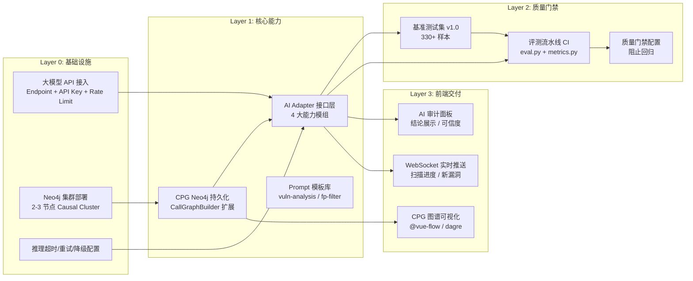

# AI 能力分层实施优先级 Spec

> **版本**: v1.1  
> **状态**: Draft  
> **关联**: 全部 `docs/designs/*.md` 五份设计文档  
> **目标**: 定义 AI 增强功能的构建顺序、层间依赖、并行策略和里程碑  
> **模型底座**: 大模型 API（内部 API 网关，非自管 GPU/vLLM）

---

## 0. 分层总览

```
时间轴 →   Layer 0      Layer 1      Layer 2      Layer 3
          ┌─────────┐  ┌─────────┐  ┌─────────┐  ┌─────────┐
          │ 基础设施  │→│ 核心能力  │→│ 质量门禁  │→│ 前端交付  │
          │ API配置   │  │ CPG+AI  │  │ 评测体系  │  │ AI面板   │
          │ Neo4j    │  │ 接口层   │  │ CI集成   │  │ 图谱    │
          └─────────┘  └─────────┘  └─────────┘  └─────────┘
并行度:    完全并行      适度并行        串行         部分并行
依赖:     无依赖        L0 → L1       L1 → L2      L1 → L3
注:       大模型走 API，项目本身无 GPU 基础设施负担
```

**L4（运营闭环）不再作为独立实施层**，改为 L1-L3 各层内置的可观测性埋点，持续累积。

---

## 1. 依赖关系图



---

## 2. Layer 0 — 基础设施（T+0 ~ T+0.5 周）

### 2.1 范围

| 工作项 | 工时估计 | 前置依赖 | 交付物 |
|--------|----------|----------|--------|
| 大模型 API 接入配置（endpoint / key / model name） | 0.5 天 | API 网关就绪 | `application.yml` 配置 |
| 推理超时 / 重试 / 限流配置 | 0.5 天 | API 接入 | Resilience4j 配置 |
| Neo4j 集群部署 | 1 天 | K8s 节点 | 2-3 节点 Causal Cluster |
| Spring Data Neo4j 依赖引入 + 基础配置 | 0.5 天 | Neo4j 就绪 | `pom.xml` + `application.yml` |

### 2.2 并行策略

API 配置与 Neo4j 部署完全并行。

### 2.3 成功标准

- [ ] `curl $LLM_API_ENDPOINT/health` → `{"status": "ok"}`
- [ ] `curl neo4j:7687` → Bolt 协议应答
- [ ] Spring Boot 启动时正确连接 Neo4j

### 2.4 大模型 API 配置设计

```yaml
# application.yml — 模型 API 配置
codex:
  enabled: true
  mode: api                      # 仅 API 模式，无 CLI 模式
  api:
    codex:
      endpoint: "${CODEX_API_ENDPOINT}"    # 代码模型 API 地址
      apiKey: "${CODEX_API_KEY}"
      model: "${CODEX_MODEL_NAME}"         # 如 codeqwen-7b
      timeoutSeconds: 60
      maxRetries: 2
    llm:
      endpoint: "${LLM_API_ENDPOINT}"      # 语义模型 API 地址
      apiKey: "${LLM_API_KEY}"
      model: "${LLM_MODEL_NAME}"           # 如 qwen2.5-14b
      timeoutSeconds: 30
      maxRetries: 2
    embedding:
      endpoint: "${EMBEDDING_API_ENDPOINT}"
      model: "${EMBEDDING_MODEL_NAME}"     # 如 bge-large-zh
  
  # 并发控制（API 模式的并发 = 控制最大并行请求数）
  maxConcurrency: 8
  perRequestTimeoutSeconds: 30
  
  # 能力开关
  capabilities:
    vuln-analysis: true
    false-positive-filter: true
    poc-generation: false       # V1.1
    patch-generation: false     # V1.1
```

---

## 3. Layer 1 — 核心能力（T+0.5 ~ T+4 周）

### 3.1 范围

| 工作项 | 工时估计 | 前置依赖 | 交付物 |
|--------|----------|----------|--------|
| **CPG Neo4j 持久化** | | | |
| 1a. MethodNode / ClassNode / CallRelation 实体 | 1 天 | Neo4j | Spring Data Neo4j 实体 |
| 1b. CpgBuilder.buildAndPersist() | 2 天 | 实体 | 全量 CPG 写入 Neo4j |
| 1c. 增量更新（hash diff → MERGE） | 2 天 | 全量构建 | 增量扫描写入 |
| 1d. ReachableAnalyzer 双数据源（Neo4j → 内存兜底）| 1 天 | 增量更新 | 透明降级 |
| **AI Adapter 接口层** | | | |
| 2a. AiAdapter 接口 + HttpClient 抽象 | 1 天 | API endpoint | 接口定义 |
| 2b. AiApiClient（HTTP/gRPC → 模型 API） | 1 天 | 接口 | API 调用实现 |
| 2c. VulnAnalysisCapability | 2 天 | Client | 漏洞分析能力 |
| 2d. FalsePositiveFilterCapability | 1 天 | Client | 误报过滤能力 |
| 2e. AnalysisPipeline + FallbackStrategy | 1 天 | 能力模组 | 编排 + 3 级降级 |
| **Prompt 模板库** | | | |
| 3a. vuln-analysis.yaml + fp-filter.yaml | 1 天 | - | 2 个 Prompt 模板 |
| 3b. 语言特定模板（java/go/python） | 1 天 | 通用模板 | 3 套子模板 |
| **可观测性埋点**（内置于各组件） | | | |
| 4a. AI 调用延迟 / Token 用量 / 错误率 Micrometer | 0.5 天 | - | metrics 埋点 |
| 4b. 降级触发率 / 模型响应一致性 | 0.5 天 | - | 自定义指标 |

### 3.2 核心变化说明

相较于 v1.0（自管 GPU）版本，此版本的关键简化：

| 项目 | 自管 GPU | API 模式 |
|------|----------|----------|
| CodeXClient | CliClient + ApiClient 两种 | 仅 ApiClient（HTTP 调用）|
| 并发控制 | Semaphore 限制 GPU 推理并发 | 控制 HTTP 连接池 + 请求限流 |
| 降级触发条件 | GPU 宕机 / 模型 OOM | API 超时 / 限流 429 / 认证失败 |
| 资源瓶颈 | VRAM / GPU 利用率 | API Rate Limit / 网络延迟 |

### 3.3 降级策略调整

```java
public class FallbackStrategy {

    /** 大模型 API 场景的降级路径 */
    public AnalysisPath resolvePath(ApiHealth codexApi, ApiHealth llmApi) {
        if (codexApi.isOk() && llmApi.isOk()) {
            return AnalysisPath.DUAL_MODEL;          // 等级 0: 双模型协同
        }
        if (!codexApi.isOk() && llmApi.isOk()) {
            return AnalysisPath.LLM_ONLY;            // 等级 1: 仅 LLM
        }
        if (codexApi.isOk() && !llmApi.isOk()) {
            return AnalysisPath.CODEX_PLUS_SAST;     // 等级 2: CodeX + 传统 SAST
        }
        return AnalysisPath.SAST_ONLY;               // 等级 3: 纯 SAST 兜底
    }
}

/** API 健康状态判断标准 */
public class ApiHealth {
    private boolean ok;              // 接口可正常返回
    private int statusCode;          // HTTP 状态码
    private long latencyMs;          // 本次响应延迟
    private boolean rateLimited;     // 是否触发限流 (429)
    private String errorMessage;     // 错误信息
}
```

### 3.4 并发与限流设计

```yaml
# API 调用模式下的并发控制
codex:
  api:
    # 连接池
    connectionPool:
      maxTotal: 10
      maxPerRoute: 4
      connectTimeout: 5000
      socketTimeout: 30000
    
    # 限流（保护模型 API 不被打爆）
    rateLimit:
      codex:
        maxRequestsPerSecond: 5
        maxConcurrent: 4
      llm:
        maxRequestsPerSecond: 10
        maxConcurrent: 8
    
    # 退避策略
    backoff:
      initialDelayMs: 1000
      multiplier: 2
      maxDelayMs: 30000
      retryOn: [429, 500, 502, 503]
```

### 3.5 并行策略

```
T+0.5        T+1.5        T+2.5        T+3.5        T+4
├── CPG 1a ──┤
│            ├── CPG 1b ──┤
│            │            ├── CPG 1c ──┤
│            │            │            ├── CPG 1d ──┤
│            │            │            │            │
├── AI 2a ───┤
│            ├── AI 2b ──────────────────────────────┤
│            │            ├── AI 2c ──┤
│            │            │          ├── AI 2e ─────┤
│            │            ├── AI 2d ──┤             │
│            │            │            │            │
├── Prompt 3a┤
│            ├── Prompt 3b┤
│            │            │            │            │
├── Obs 4a ─────────────────────────────────────────┤
│            │            │            │            │
```

CPG 和 AI Adapter **完全并行**。可观测性埋点贯穿全程。

### 3.6 成功标准

- [ ] `CpgService.importGraph()` 成功写入 100KLOC 项目的 CPG
- [ ] Neo4j 可达性查询 P99 < 200ms
- [ ] `AiAdapter.analyzeVuln()` 返回结构化 JSON，总延迟 < 10s（含 API 调用）
- [ ] `AiAdapter.batchFilter()` 单批 100 条 < 30s
- [ ] API 限流正确触发（并发超限 → 排队等待，不抛异常）
- [ ] 降级策略：手动断开 CodeX API → LLM_ONLY 自动切换 < 5s
- [ ] Micrometer 指标 `ai_request_duration_seconds` / `ai_tokens_total` / `ai_fallback_total` 有数据

---

## 4. Layer 2 — 质量门禁（T+3.5 ~ T+5.5 周）

### 4.1 范围

| 工作项 | 工时估计 | 前置依赖 | 交付物 |
|--------|----------|----------|--------|
| 基准测试集 v1.0 构建（330+ 样本） | 3 天 | - | 标注数据集 |
| eval.py / metrics.py / report.py 工具链 | 2 天 | - | CLI 工具 |
| 质量门禁 YAML 配置 | 0.5 天 | - | gates/v1.0.yaml |
| CI 流水线集成（GitLab CI template） | 1 天 | 工具链 | `.gitlab-ci.yml` 片段 |
| 基线评测 + 基线锁定 | 0.5 天 | C1-C4 | baseline report.json |

### 4.2 对 API 模式的适配

API 模式评测与自管 GPU 模式的主要差异：

| 维度 | 自管 GPU 模式 | API 模式 |
|------|-------------|---------|
| 调用方式 | vLLM 内部 HTTP | 模型 API 外部 HTTP |
| 成本影响 | 固定电力成本 | **按 Token 计费**（需要成本追踪）|
| 评测触发条件 | 模型文件/配置变更 | **模型 API 版本变更 / Prompt 变更** |
| 延迟波动 | 稳定（独占 GPU）| 波动大（多租户共享 API）|

因此 L2 新增一个工作项：

| 工作项 | 工时估计 | 前置依赖 | 交付物 |
|--------|----------|----------|--------|
| **Token 成本追踪**（每次评测记录消耗 Token + 估算成本） | 1 天 | 工具链 | `cost_tracker.py` |

### 4.3 评测的 API 版本锚定

```yaml
# evaluation/gates/v1.0.yaml — 扩展：API 版本锚定
api_version_anchor:
  codex:
    endpoint: "${CODEX_API_ENDPOINT}"
    model: "codeqwen-7b-v2.1"
    required: true              # 评测时必须指定版本
  llm:
    endpoint: "${LLM_API_ENDPOINT}"
    model: "qwen2.5-14b-v1.0"
    required: true

# 评测报告中记录 API 版本信息，以便对比
```

### 4.4 成功标准

- [ ] `python eval.py --dataset v1.0 --output ./report` 完整执行
- [ ] 质量门禁正确阻断 Precision 下降的模型/Prompt 变更
- [ ] CI 流水线在 Adapter/Prompt 代码变更时自动触发评测
- [ ] 评测报告包含 API 版本 + Token 消耗 + 成本估算

---

## 5. Layer 3 — 前端交付（T+4 ~ T+7 周）

### 5.1 范围

| 工作项 | 工时估计 | 前置依赖 | 交付物 |
|--------|----------|----------|--------|
| **AI 审计面板** | | | |
| 1a. AiVerdictHeader + AiConfidenceBadge | 1 天 | - | 2 个 Vue 组件 |
| 1b. AiFixSuggestion（diff 展示） | 1.5 天 | - | 修复建议组件 |
| 1c. AiBatchActions + aiAuditStore | 1 天 | - | 批量操作 + Pinia store |
| **CPG 图谱可视化** | | | |
| 2a. @vue-flow + dagre 集成 | 1 天 | - | 渲染引擎就绪 |
| 2b. CallGraphView（函数调用链） | 2 天 | 2a | 交互式调用图 |
| 2c. TaintFlowView（污点传播） | 2 天 | 2a | 污点路径图 |
| **WebSocket 实时推送** | | | |
| 3a. useWebSocket composable（STOMP）| 1 天 | - | WS 封装 |
| 3b. ScanProgressBar + RealtimeNotification | 1 天 | 3a | 2 个实时组件 |
| **审计工作台增强** | | | |
| 4a. AuditWorkbench 三栏布局重构 | 1 天 | - | 新布局 |
| 4b. 快捷键体系 + 批量操作 | 1 天 | - | 键盘导航 |

### 5.2 并行策略

四条线完全并行，与 Layer 1~2 有 2 周重叠。

### 5.3 成功标准

- [ ] 漏洞详情页展示 AI 结论 + 置信度 + 污点链路
- [ ] 调用链图 1000 节点渲染 < 2s
- [ ] 扫描进度通过 WebSocket 实时推送 < 1s 延迟
- [ ] 快捷键覆盖 80% 常用操作

---

## 6. 关键路径（Critical Path）

```
Neo4j 部署 → CPG 持久化 ───────────────────────────→ CPG 图谱可视化
                                                       ↘
模型 API 配置 → AI Adapter → 评测流水线 → 质量门禁   → AI 审计面板
                              ↘ 前端 AI 面板 ↗

最短关键路径: Layer 0 → 1 → 2 → 3 = ~7 周
最短非关键路径: Neo4j → CPG → 图谱可视化 = ~4.5 周（与 AI 主线并行）
```

### 6.1 里程碑

| 里程碑 | 时间 | Layer | 交付物 |
|--------|------|-------|--------|
| **M0: 底座就绪** | T+0.5W | L0 | API 配置 + Neo4j 可用 |
| **M1: AI 能力上线** | T+4W | L1 | AI 漏洞分析 + 误报过滤可调用 |
| **M2: 质量可控** | T+5.5W | L2 | 评测流水线 + 质量门禁 |
| **M3: 前端可用** | T+7W | L3 | AI 审计面板 + 图谱 + 实时推送上线 |

### 6.2 风险缓冲

| 风险 | 概率 | 影响 | 缓冲措施 |
|------|------|------|----------|
| API 延迟波动大 | 中 | AI 分析延迟 > 10s | 异步调用 + 前端骨架屏 |
| API Rate Limit 不足 | 低 | 批量过滤被限流 | 本队列缓冲 + 退避重试 |
| 模型版本升级不兼容 | 中 | 响应格式变化 | API 响应 Schema 校验 + 版本协商 |
| API 成本超出预期 | 低 | 运营成本高 | Token 用量监控 + 用量告警 |
| Neo4j 性能不足 | 低 | CPG 查询慢 | 增加缓存层 / 限深度查询 |

---

## 7. 资源分配建议

```yaml
team_allocation:
  phase_1_l0_l1:
    backend_engineer: 2   # CPG + AI Adapter + Prompt
    total: 2
    # 无 devops 需求（API 模式无需 GPU 运维）

  phase_2_l2:
    ai_engineer: 1        # 基准数据集 + 评测工具链
    total: 1

  phase_3_l3:
    frontend_engineer: 2  # AI 面板 + 图谱 + WebSocket
    total: 2

  peak_team_size: 4       # L1 + L2 重叠期
```

---

## 8. Layer 间契约

### 8.1 回退策略

| 场景 | 降级方案 | 影响 |
|------|----------|------|
| Layer 1 CPG 未就绪 | AI 使用内存 CPG（现有 ReachableAnalyzer）| 失去跨服务追踪 |
| Layer 1 AI 未就绪 | 纯传统 SAST 模式 | 失去 AI 审计能力，扫描不中断 |
| Layer 2 门禁未就绪 | 人工对比评估代替 CI 门禁 | 模型升级风险增加 |
| Layer 3 前端未就绪 | AI 结论仅通过 API 返回 | 看不到可视化图谱 |

### 8.2 API 契约（Layer 1 → Layer 3）

```typescript
// POST /api/v1/ai/analyze
{ vulnId: string, snippet: string, language: string, cpgContext?: CallChain }

// 响应（含元数据追踪）
{
  vulnerable: boolean,
  vulnType: "sqli" | "xss" | "cmdi" | ...,
  cwe: string,
  confidence: number,          // 0.0 - 1.0
  reason: string,
  taintChain: Array<{ node: string, line: number, type: "source"|"propagation"|"sink" }>,
  fixSuggestion?: string,
  fixDiff?: { before: string, after: string },
  // 以下为可观测性元数据
  _meta: {
    modelVersion: string,      // 实际使用的模型版本
    latencyMs: number,         // 端到端延迟
    tokensUsed: number,        // Token 消耗
    fallbackLevel: "none" | "llm_only" | "codex_sast" | "sast_only"
  }
}

// GET /api/v1/ai/health
{
  codexAvailable: boolean,
  llmAvailable: boolean,
  activePath: "dual" | "llm_only" | "codex_sast" | "sast_only",
  codexRateLimitRemaining: number,
  llmRateLimitRemaining: number
}
```

### 8.3 数据契约（Neo4j → AI Adapter）

```typescript
// CPG 上下文数据格式
interface CpgContext {
  callChain: string[],
  entryPoint: { method: string, httpMethod: string, httpPath: string } | null,
  taintSources: { param: string, sourceType: string }[],
  frameworkProtection: { framework: string, annotation: string }[],
  reachable: boolean,
  depth: number
}
```

---

## 9. 与 v1.0 版本的核心差异总结

| 项目 | v1.0（自管 GPU） | v1.1（API 模式） | 影响 |
|------|------------------|-----------------|------|
| L0 工作量 | ~3 天（GPU 配置 + 模型部署 + vLLM） | ~1 天（仅 API 配置 + Neo4j） | L0 缩短 66% |
| CodeXClient | CliClient + ApiClient | 仅 ApiClient（HTTP） | 代码减少 ~40% |
| 并发控制 | GPU VRAM / Semaphore | HTTP 连接池 + Rate Limiter | 实现更简单 |
| 降级触发 | GPU 宕机 / OOM | API 超时 / 429 / 认证失败 | 判断条件变化 |
| GPU 监控 | DCGM Exporter + GPU 指标 | 无 | 不再需要 |
| 总工期 | ~9-11 周 | ~7 周 | 缩短 ~30% |
| 团队峰值 | 5 人 | 4 人 | 减少 1 人 |
| 成本结构 | 固定 GPU 采购/租赁 | 按 Token 计费（可变）| 需要成本追踪 |
| 模型升级 | 自管模型文件 | API 网关切换模型版本 | 更灵活但需版本锚定 |

---

## 10. Spec 更新维护

| 场景 | 更新动作 | 责任人 |
|------|----------|--------|
| API 网关切换模型 | 更新 L1 配置 + L2 版本锚定 | Tech Lead |
| 依赖关系变更 | 更新依赖图 + 关键路径 | Architect |
| 里程碑延期 > 1 周 | 更新里程碑时间 | PM |
| 新增 Layer | 追加 Layer 4+ | Architect |
